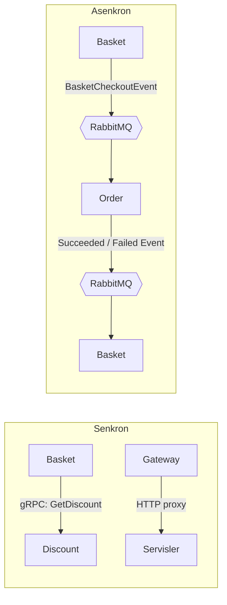

# 01 — Sistem Genel Bakış

## Amaç

`ECommerce_Microservices`, modern .NET 9 ekosistemi üzerinde mikroservis mimarisinin temel
desenlerini gösteren bir referans uygulamadır:

- Servis düzeyinde veri sahipliği (database-per-service)
- Senkron iletişim: HTTP (Minimal API + Carter) ve gRPC
- Asenkron iletişim: RabbitMQ üzerinden MassTransit ile entegrasyon event'leri
- Dayanıklı, eventual-consistent checkout orkestrasyonu (Outbox + Saga / choreography)
- MediatR ile CQRS, FluentValidation, Mapster, pipeline davranışları

## Servisler

| Servis | Sorumluluk | Depolama / Entegrasyon | Mimari Stil | Docker Port | Local HTTP Port |
|---|---|---|---|---|---|
| **CatalogAPI** | Ürün CRUD & gezinme | PostgreSQL (Marten) | Vertical slice | 6000 | 5000 |
| **BasketAPI** | Sepet CRUD, indirimli fiyatlama, checkout başlatma | PostgreSQL (Marten), Redis, gRPC istemci, RabbitMQ | Vertical slice | 6001 | 5001 |
| **DiscountGrpc** | Kupon yönetimi (gRPC) | SQLite (EF Core) | gRPC servis | 6002 | 5002 |
| **Order.API** | Sipariş CRUD, event'ten sipariş oluşturma | SQL Server (EF Core), RabbitMQ | Clean Architecture | 6003 | 5003 |
| **YarpApiGateway** | Reverse proxy + rate limiting | Servislere proxy | — | 5004 | 5004 |

> **Not:** Gateway docker-compose içinde değildir; gerektiğinde ayrı çalıştırılır.

## Mimari Stiller — İki Yaklaşım Bir Arada

Çözüm bilinçli olarak iki farklı yapısal stili barındırır. Yeni kod yazarken hedef servisin
kullandığı stil korunmalıdır.

### 1. Vertical Slice (Catalog / Basket / Discount)
Tek bir API projesi içinde her özellik kendi klasöründe yaşar: endpoint + command/query +
handler + validator + response birlikte. Özellikler birbirinden bağımsızdır.

```
Products/
  CreateProduct/
    CreateProductEndpoint.cs
    CreateProductCommandHandler.cs   # command + validator + result + handler aynı dosyada
```

### 2. Katmanlı Clean Architecture (Order)
Sorumluluklar dört projeye ayrılır; bağımlılıklar içe doğru akar:

```
Order.API            → Order.Application, Order.Infrastructure   (sunum / composition root)
Order.Infrastructure → Order.Application                          (EF Core, kalıcılık)
Order.Application    → Order.Domain, BuildingBlocks               (CQRS, iş mantığı)
Order.Domain         → (dış bağımlılık yok, sadece MediatR)        (aggregate, VO, event)
```

## İletişim Modelleri



| Tür | Teknoloji | Kullanım |
|---|---|---|
| Senkron (request/response) | HTTP (Minimal API + Carter) | İstemci ↔ servis, gateway proxy |
| Senkron (düşük gecikme, contract-first) | gRPC | Basket → Discount kupon fiyatlama |
| Asenkron (event-driven) | RabbitMQ + MassTransit | Checkout akışı, servisler arası gevşek bağ |

## Teknoloji Yığını

- **.NET 9**, **Minimal API** + **Carter** modülleri (`ICarterModule`)
- **MediatR** — komut & sorgular; pipeline davranışları `BuildingBlock` içinde
- **FluentValidation** — komut başına bir validator, doğrulama davranışıyla otomatik tetiklenir
- **Mapster** — nesne eşleme (`.Adapt<T>()`)
- **Marten** (PostgreSQL üzerinde document DB) — Catalog & Basket
- **EF Core** — Order (SQL Server) & Discount (SQLite)
- **MassTransit + RabbitMQ** — entegrasyon event'leri
- **Redis** — Basket'te read-through cache (decorator deseni)
- **YARP** — gateway, route config + fixed-window rate limiter
- **Serilog** — yapılandırılmış (JSON) loglama
- **Polly** — Catalog seeding'inde geçici hatalar için retry
- **Health checks** — Catalog, Basket, Order için `GET /health`

## Depo Yerleşimi

```text
ECommerce_Microservices/
├── Src/
│   ├── ApiGateways/YarpApiGateway/
│   ├── BuildingBlocks/
│   │   ├── BuildingBlock/            # CQRS soyutlamaları, behaviors, exceptions, pagination
│   │   └── BuildingBlockMessaging/   # entegrasyon event'leri, MassTransit kayıt yardımcıları
│   └── Services/
│       ├── CatalogAPI/               # Minimal API + Carter + Marten (vertical slice)
│       ├── Basket/BasketAPI/         # + Redis + gRPC client + Outbox
│       ├── DiscountGrpc/             # gRPC + EF Core (SQLite)
│       └── Order/
│           ├── Order.API/            # Carter endpoint'leri, composition root
│           ├── Order.Application/    # MediatR handler'ları, DTO, validator, consumer
│           ├── Order.Domain/         # entity, value object, domain event, soyutlamalar
│           └── Order.Infrastructure/ # EF Core DbContext, configuration, migration
├── Tests/ECommerce_Tests/            # xUnit + Moq
├── docker-compose.yml
└── docker-compose.override.yml
```

Devamı: [02 — Building Blocks](02-building-blocks.md)
