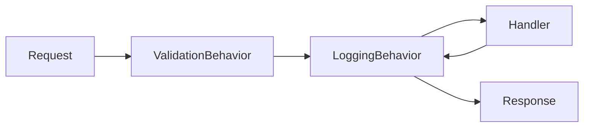

# 02 — Building Blocks (Paylaşılan Katman)

`Src/BuildingBlocks` altında, tüm servislerin paylaştığı iki proje bulunur:

- **BuildingBlock** — CQRS soyutlamaları, MediatR pipeline davranışları, exception yönetimi, pagination.
- **BuildingBlockMessaging** — entegrasyon event sözleşmeleri ve MassTransit kayıt yardımcısı.

---

## BuildingBlock

### CQRS Soyutlamaları

`CQRS/ICommand.cs`, `CQRS/IQuery.cs` ve `CQRS/Handlers/` MediatR üzerine ince bir sözleşme katmanı kurar:

```csharp
// Command — yazma işlemleri
public interface ICommand : ICommand<Unit> { }
public interface ICommand<out TResponse> : IRequest<TResponse> { }

// Query — okuma işlemleri
public interface IQuery<TResponse> : IRequest<TResponse> where TResponse : notnull { }

// Handler'lar
public interface ICommandHandler<in TCommand>
    : ICommandHandler<TCommand, Unit> where TCommand : ICommand<Unit> { }

public interface ICommandHandler<in TCommand, TResponse>
    : IRequestHandler<TCommand, TResponse>
    where TCommand : ICommand<TResponse> where TResponse : notnull { }

public interface IQueryHandler<in TQuery, TResponse>
    : IRequestHandler<TQuery, TResponse>
    where TQuery : IQuery<TResponse> where TResponse : notnull { }
```

**Konvansiyon:** Command'ler `Command`, query'ler `Query`, handler'lar `Handler` ile biter;
response/DTO'lar `record` tipidir.

### Pipeline Davranışları (Behaviors)

Her MediatR isteği, handler'a ulaşmadan önce davranış zincirinden geçer:



#### ValidationBehavior — `Behaviors/ValidationBehavior.cs`
İstek tipine kayıtlı tüm `IValidator<TRequest>`'ları **paralel** çalıştırır; hata varsa
handler'a hiç ulaşmadan `ValidationException` fırlatır.

```csharp
var failures = validationResults
    .Where(r => r.Errors.Any())
    .SelectMany(r => r.Errors)
    .ToList();
if (failures.Any())
    throw new ValidationException(failures);
return await next();
```

#### LoggingBehavior — `Behaviors/LoggingBehavior.cs`
İstek/yanıtı loglar, süreyi `Stopwatch` ile ölçer, **3 saniyeyi** aşan istekler için
`[PERFORMANCE]` uyarısı üretir, hata durumunda payload ile birlikte loglayıp yeniden fırlatır.

> Her iki davranış da `config.AddOpenBehavior(typeof(...<,>))` ile servislerin `Program.cs`
> / DI kayıtlarında açık-generic olarak eklenir.

### Exception Yönetimi

`Exceptions/` altında uygulama exception tipleri tanımlıdır:

| Exception | HTTP Status |
|---|---|
| `NotFoundExceptions` | 404 Not Found |
| `BadRequestException` | 400 Bad Request |
| `ValidationException` (FluentValidation) | 400 Bad Request (+ `ValidationError` detayı) |
| `InternalServerException` | 500 Internal Server Error |
| Diğer | 500 Internal Server Error |

#### CustomExceptionHandler — `Exceptions/Handlers/CustomExceptionHandler.cs`
`IExceptionHandler` implementasyonudur; exception'ı bir `ProblemDetails` nesnesine map'ler,
`traceId` ekler, `ValidationException` ise hata listesini `ValidationError` uzantısı olarak
ekleyip JSON döner. Servislerde `AddExceptionHandler<CustomExceptionHandler>()` +
`UseExceptionHandler(...)` ile devreye girer.

### Pagination — `Pagination/`

```csharp
public record PaginationRequest(int PageIndex = 0, int PageSize = 10);

public class PaginatedResult<TEntity>(int pageIndex, int pageSize, long count, IEnumerable<TEntity> data)
    where TEntity : class
{
    public int PageIndex { get; }
    public int PageSize { get; }
    public IEnumerable<TEntity> Data { get; }
    public long Count { get; }
}
```

Order servisinin `GetOrders` sorgusu bu jenerik sayfalama tipini kullanır.

---

## BuildingBlockMessaging

### IntegrationEvent Temel Tipi — `Events/IntegrationEvent.cs`

```csharp
public record IntegrationEvent
{
    public Guid id => Guid.NewGuid();
    public DateTime OccuredOn => DateTime.UtcNow;
    public string EventType => GetType().AssemblyQualifiedName;
}
```

Tüm entegrasyon event'leri bu kaydı miras alır. Sözleşmeler burada merkezi olarak yaşar;
**bir event'i değiştirmek tüm producer/consumer'ları etkileyen breaking change'dir.**

### Entegrasyon Event Sözleşmeleri

| Event | Üreten | Tüketen | İçerik (özet) |
|---|---|---|---|
| `BasketCheckoutEvent` | Basket (Outbox) | Order | CheckoutId, UserName, CustomerId, TotalPrice, Items[], adres alanları, tokenize ödeme |
| `BasketCheckoutSucceededEvent` | Order | Basket | CheckoutId, UserName, OrderId |
| `BasketCheckoutFailedEvent` | Order | Basket | CheckoutId, UserName, Reason |
| `BasketCheckoutItemEvent` | (alt nesne) | — | ProductId, ProductName, Quantity, Price |

```csharp
public record BasketCheckoutEvent : IntegrationEvent
{
    public Guid CheckoutId { get; set; }
    public string UserName { get; set; }
    public Guid CustomerId { get; set; }
    public decimal TotalPrice { get; set; }
    public List<BasketCheckoutItemEvent> Items { get; set; } = [];

    // Shipping + Billing adres alanları
    public string FirstName, LastName, EmailAddress, AddressLine, Country, State, ZipCode { get; set; }

    // Tokenize ödeme detayları — ham PAN/CVV taşınmaz
    public string CardName, PaymentToken, PaymentReference, CardLast4, CardBrand { get; set; }
    public int PaymentMethod { get; set; }
}
```

> **Güvenlik notu:** Event yalnızca tokenize ödeme bilgisi (PaymentToken, CardLast4, CardBrand)
> taşır; ham kart numarası / CVV asla taşınmaz.

### MassTransit Kaydı — `MassTransit/Extentions.cs`

```csharp
public static IServiceCollection AddMessageBroker(
    this IServiceCollection service, IConfiguration configuration, Assembly? assembly = null)
{
    service.AddMassTransit(config =>
    {
        config.SetKebabCaseEndpointNameFormatter();

        // Consumer'lar yalnızca tüketen serviste taranır (reflection).
        if (assembly is not null)
            config.AddConsumers(assembly);

        config.UsingRabbitMq((context, configurator) =>
        {
            configurator.Host(new Uri(configuration["MessageBroker:Host"]!), host =>
            {
                host.Username(configuration["MessageBroker:UserName"]!);
                host.Password(configuration["MessageBroker:Password"]!);
            });
            configurator.ConfigureEndpoints(context);
        });
    });
    return service;
}
```

**Önemli ayrıntılar:**
- **Kebab-case endpoint adlandırma:** Kuyruk adları otomatik olarak kebab-case'e dönüştürülür.
- **Assembly parametresi:** Sadece tüketen servisler (Basket, Order) `assembly` verir; böylece
  MassTransit `IConsumer<>` sınıflarını bulup kaydeder. Salt-publisher servisler vermez.
- **Yaygın hata:** Yeni bir consumer eklenip kaydedilmezse event'ler sessizce kaybolur.

Devamı: [03 — Catalog Servisi](03-catalog-service.md)
