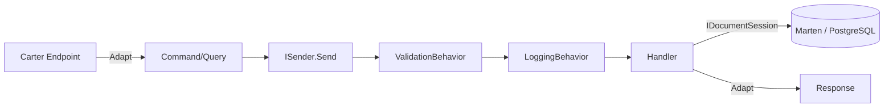

# 03 — Catalog Servisi

**Sorumluluk:** Ürün CRUD ve gezinme.
**Depolama:** PostgreSQL (Marten document DB).
**Mimari stil:** Vertical slice (her özellik kendi klasöründe).
**Portlar:** Docker `6000` (HTTP) / `6060` (HTTPS), local `5000`.

---

## Klasör Yapısı

```text
CatalogAPI/
├── Products/
│   ├── GetProducts/            GetProductsEndpoint.cs + GetProductsQueryHandler.cs
│   ├── GetProductById/         GetProductByIdEndpoint.cs + GetProductByIdQueryHandler.cs
│   ├── GetProductByCategory/   GetProductByCategoryEndpoint.cs + GetProductByCategoryHandler.cs
│   ├── CreateProduct/          CreateProductEndpoint.cs + CreateProductCommandHandler.cs
│   ├── UpdateProdcut/          UpdateProductEndpoint.cs + UpdateProductCommandHandler.cs  (klasör adı yazım hatalı)
│   └── DeleteProduct/          DeleteProductEndpoint.cs + DeleteProductCommandHandler.cs
├── Models/Entities/Product.cs
├── Exceptions/ProductNotFoundException.cs
├── InitialData/CatalogInitialData.cs
└── Program.cs
```

## Endpoint'ler

| Metod | Route | İşlem | Yanıt |
|---|---|---|---|
| GET | `/products` | Sayfalı ürün listesi (PageNumber, PageSize) | `GetProductsResponse` |
| GET | `/products/{id}` | ID ile ürün; yoksa 404 | `GetProductByIdResponse` |
| GET | `/products/category/{category}` | Kategoriye göre filtre | `GetProductByCategoryResponse` |
| POST | `/product-create` | Ürün oluştur | 201 + `CreateProductResponse(Guid Id)` |
| PUT | `/product-update` | Ürün güncelle; yoksa 404 | `UpdateProductResponse(bool)` |
| DELETE | `/product-delete/{id}` | Ürün sil | `DeleteProductResponse(bool)` |
| GET | `/health` | PostgreSQL sağlık kontrolü | HealthCheck UI JSON |

## İstek İşleme Akışı (Vertical Slice + CQRS)



Tipik bir endpoint (CreateProduct):

```csharp
app.MapPost("/product-create", async (CreateProductRequest request, ISender sender) =>
{
    var command = request.Adapt<CreateProductCommand>();
    var result  = await sender.Send(command);
    var response = result.Adapt<CreateProductResponse>();
    return Results.Created($"/products/{response.Id}", response);
});
```

## CQRS Detayları

Her slice; **record command/query + result**, **FluentValidation validator** (yazma işlemlerinde)
ve **handler** içerir.

```csharp
public record CreateProductCommand(Guid Id, string Name, List<string> Category,
    string Description, string ImageFile, decimal Price) : ICommand<CreateProductResult>;

public class CreateProductCommandValidator : AbstractValidator<CreateProductCommand>
{
    public CreateProductCommandValidator()
    {
        RuleFor(x => x.Name).NotEmpty();
        RuleFor(x => x.Category).NotEmpty();
        RuleFor(x => x.ImageFile).NotEmpty();
        RuleFor(x => x.Price).GreaterThan(0);
    }
}

internal class CreateProductCommandHandler(IDocumentSession session)
    : ICommandHandler<CreateProductCommand, CreateProductResult>
{
    public async Task<CreateProductResult> Handle(CreateProductCommand cmd, CancellationToken ct)
    {
        var product = new Product { /* ... */ };
        session.Store(product);
        await session.SaveChangesAsync(ct);
        return new CreateProductResult(product.Id);
    }
}
```

- **GetProductById** → yoksa `ProductNotFoundException` (404).
- **GetProductByCategory** → `Where(p => p.Category.Contains(query.Category))`.
- **GetProducts** → Marten `.ToPagedListAsync(...)` ile sayfalama.

## Veri Modeli — `Models/Entities/Product.cs`

```csharp
public class Product
{
    public Guid Id { get; set; }
    public string Name { get; set; } = default!;
    public List<string> Category { get; set; } = new();
    public string Description { get; set; } = default!;
    public string ImageFile { get; set; } = default!;
    public decimal Price { get; set; }
}
```

## Kalıcılık — Marten / PostgreSQL

```csharp
var connString = builder.Configuration.GetConnectionString("PostgreDataBase");
builder.Services.AddMarten(options => options.Connection(connString))
                .UseLightweightSessions();

if (builder.Environment.IsDevelopment())
    builder.Services.InitializeMartenWith<CatalogInitialData>();
```

- **Lightweight sessions:** Değişiklik izleme olmadan performanslı doküman erişimi.
- **Bağlantı (local):** `Server=localhost;Port=5432;Database=CatalogDb;User Id=postgres;Password=postgres`.
- **Seeding:** `CatalogInitialData` (Development), 7 önceden tanımlı ürün; **Polly** ile geçici
  bağlantı hatalarında (Npgsql/Socket) 2s/5s/10s retry. Ürün varsa atlar (idempotent).

## Çapraz Kesen Konular

- **Serilog:** `ServiceName=CatalogAPI` zenginleştirmesiyle konsola compact JSON; `UseSerilogRequestLogging()`.
- **CustomExceptionHandler:** Tutarlı `ProblemDetails` hata yanıtları.
- **Health checks:** `AddNpgSql(...)` → `GET /health`.

## Bağımlılıklar (CatalogAPI.csproj)

`Carter 9.0.0`, `Marten 7.38.1`, `AspNetCore.HealthChecks.NpgSql 9.0.0`,
`AspNetCore.HealthChecks.UI.Client 9.0.0`, `Polly 8.6.5`, `Serilog.AspNetCore 9.0.0`,
`Microsoft.AspNetCore.OpenApi 9.0.2`. MediatR/FluentValidation/Mapster `BuildingBlock` üzerinden gelir.

Devamı: [04 — Basket Servisi](04-basket-service.md)
