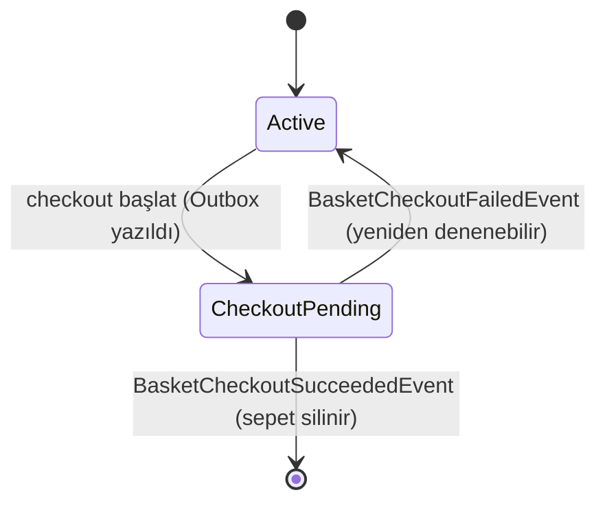

# 04 — Basket Servisi

**Sorumluluk:** Sepet CRUD, indirim-bilinçli fiyatlama, checkout başlatma.
**Depolama/Entegrasyon:** PostgreSQL (Marten), Redis (cache), Discount'a gRPC istemci, RabbitMQ (MassTransit).
**Mimari stil:** Vertical slice + Outbox/Saga.
**Portlar:** Docker `6001` (HTTP) / `6061` (HTTPS), local `5001`.

---

## Klasör Yapısı

```text
BasketAPI/
├── Basket/
│   ├── GetBasket/        endpoint + GetBasketQueryHandler
│   ├── StoreBasket/      endpoint + StoreBasketCommandHandler  (Discount gRPC çağrısı)
│   ├── DeleteBasket/     endpoint + DeleteBasketCommandHandler
│   └── CheckoutBasket/   endpoint + CheckoutBasketHandler      (Outbox yazımı)
├── CheckoutSaga/
│   ├── BasketCheckoutOutboxDispatcher.cs   (BackgroundService)
│   └── BasketCheckoutResultConsumers.cs    (Succeeded/Failed consumer'ları)
├── Data/
│   ├── Abstracts/IBasketRepository.cs
│   ├── BasketRepository.cs                 (Marten)
│   └── CachedBasketRepository.cs           (Redis decorator)
├── Models/  ShoppingCard, ShoppingCardItem, BasketStatus,
│            BasketCheckoutOutboxMessage, CheckoutOutboxStatus
├── DTOs/BasketCheckoutDto.cs
├── Protos/discount.proto                   (GrpcServices="Client")
└── Program.cs
```

## Endpoint'ler

| Metod | Route | İşlem |
|---|---|---|
| GET | `/basket/{userName}` | Sepeti getir (önce Redis, sonra DB) |
| POST | `/basket-store` | Sepeti kaydet/güncelle; Discount gRPC ile indirim düş |
| DELETE | `/basket/{userName}` | Sepeti DB + cache'ten sil |
| POST | `/basket/checkout` | Checkout başlat: doğrula → Outbox mesajı yaz → sepeti `CheckoutPending` yap |
| GET | `/health` | PostgreSQL + Redis sağlık kontrolü |

## Veri Modeli

```csharp
public class ShoppingCard
{
    public string UserName { get; set; } = default!;          // Marten doküman kimliği
    public List<ShoppingCardItem> Items { get; set; } = new();
    public BasketStatus Status { get; set; } = BasketStatus.Active;
    public Guid? PendingCheckoutId { get; set; }              // devam eden checkout izleme
    public decimal TotalPrice => Items.Sum(x => x.Price * x.Quantity);  // hesaplanan
}

public class ShoppingCardItem
{
    public int Quantity { get; set; }
    public string Color { get; set; } = default!;
    public decimal Price { get; set; }      // indirim düşülmüş fiyat
    public Guid ProductId { get; set; }
    public string ProductName { get; set; } = default!;
}

public enum BasketStatus { Active = 0, CheckoutPending = 1 }
```

### Sepet Durum Makinesi



## Kalıcılık — Marten + Repository + Redis Decorator

```csharp
builder.Services.AddMarten(opts =>
{
    opts.Connection(builder.Configuration.GetConnectionString("PostgreDataBase")!);
    opts.Schema.For<ShoppingCard>().Identity(x => x.UserName);
    opts.Schema.For<BasketCheckoutOutboxMessage>().Identity(x => x.Id);
});

builder.Services.AddStackExchangeRedisCache(options =>
{
    options.Configuration = builder.Configuration.GetConnectionString("Redis");
    options.InstanceName = "Basket";
});

builder.Services.AddScoped<IBasketRepository, BasketRepository>();
builder.Services.Decorate<IBasketRepository, CachedBasketRepository>();  // Scrutor
```

**Decorator deseni (Scrutor):** Çözümleme zinciri
`IBasketRepository → CachedBasketRepository (dış) → BasketRepository (iç)`.

```csharp
public class CachedBasketRepository(IBasketRepository repository, IDistributedCache cache) : IBasketRepository
{
    public async Task<ShoppingCard> GetBasket(string userName, CancellationToken ct = default)
    {
        var cached = await cache.GetStringAsync(userName, ct);
        if (!string.IsNullOrEmpty(cached))
            return JsonSerializer.Deserialize<ShoppingCard>(cached);

        var basket = await repository.GetBasket(userName, ct);          // read-through
        await cache.SetStringAsync(userName, JsonSerializer.Serialize(basket), ct);
        return basket;
    }
    // StoreBasket → DB + cache güncelle; DeleteBasket → DB + cache sil
}
```

## gRPC Entegrasyonu — Discount Çağrısı

`StoreBasket` sırasında her ürün için Discount servisinden kupon alınıp fiyattan düşülür:

```csharp
builder.Services.AddGrpcClient<DiscountProtoService.DiscountProtoServiceClient>(o =>
    o.Address = new Uri(builder.Configuration["GrpcSettings:DiscountUrl"]!))
  .ConfigurePrimaryHttpMessageHandler(() => /* Dev'de self-signed sertifika kabulü */);

// StoreBasketCommandHandler içinde:
private async Task DeductDiscount(ShoppingCard cart, CancellationToken ct)
{
    foreach (var item in cart.Items)
    {
        var coupon = await discountProto.GetDiscountAsync(
            new GetDiscountRequest { ProductName = item.ProductName }, cancellationToken: ct);
        item.Price -= coupon.Amount;
    }
}
```

> Kestrel `Http1AndHttp2` ile yapılandırılmıştır (gRPC için gerekli). Bkz. [05 — Discount](05-discount-service.md).

## Outbox Deseni

```csharp
public class BasketCheckoutOutboxMessage
{
    public Guid Id { get; set; } = Guid.NewGuid();
    public Guid CheckoutId { get; set; }
    public string UserName { get; set; } = default!;
    public BasketCheckoutEvent Payload { get; set; } = default!;
    public CheckoutOutboxStatus Status { get; set; } = CheckoutOutboxStatus.Pending;
    public int RetryCount { get; set; }
    public string? LastError { get; set; }
    public DateTime CreatedAt { get; set; } = DateTime.UtcNow;
    public DateTime? PublishedAt { get; set; }
}

public enum CheckoutOutboxStatus { Pending = 0, Published = 1, Failed = 2 }
```

### Checkout Handler — Atomik Yazım

`CheckoutBasketHandler` sepeti yükler, doğrular (boş değil + zaten pending değil), event'i
hazırlar ve **sepet durumu + outbox mesajını aynı Marten transaction'ında** kaydeder:

```csharp
basket.Status = BasketStatus.CheckoutPending;
basket.PendingCheckoutId = checkoutId;

session.Store(basket);
session.Store(outboxMessage);
await session.SaveChangesAsync(ct);   // tek transaction → kayıpsızlık garantisi
```

### Dispatcher — `BasketCheckoutOutboxDispatcher` (BackgroundService)

Her 3 saniyede bir `Pending` mesajları (en fazla 20'lik batch) okur ve RabbitMQ'ya publish eder:

```csharp
foreach (var message in pendingMessages)
{
    try
    {
        await publishEndpoint.Publish(message.Payload, ct);
        message.Status = CheckoutOutboxStatus.Published;
        message.PublishedAt = DateTime.UtcNow;
    }
    catch (Exception ex)
    {
        message.RetryCount++;
        message.LastError = ex.Message;
        if (message.RetryCount >= 10) message.Status = CheckoutOutboxStatus.Failed;  // MaxRetry=10
    }
    session.Store(message);
}
await session.SaveChangesAsync(ct);
```

## Sonuç Consumer'ları — `BasketCheckoutResultConsumers.cs`

Her iki consumer da `basket.PendingCheckoutId == message.CheckoutId` eşleşmesini kontrol eder
(idempotency / yanlış event'i yoksayma):

- **`BasketCheckoutSucceededEventConsumer`** → sepeti DB + cache'ten **siler** (sipariş oluştu).
- **`BasketCheckoutFailedEventConsumer`** → sepeti `Active`'e döndürür, `PendingCheckoutId = null`
  (yeniden denenebilir), cache'i günceller, uyarı loglar.

## Program.cs Özeti

MediatR (+ Validation/Logging behavior), FluentValidation, Carter, Marten,
`AddStackExchangeRedisCache`, repository + Scrutor decorator, `AddGrpc()` + gRPC client,
`AddMessageBroker(config, assembly)` (consumer'lar bu assembly'den taranır),
`AddHostedService<BasketCheckoutOutboxDispatcher>()`, health checks (NpgSql + Redis),
`CustomExceptionHandler`.

## Bağımlılıklar (BasketAPI.csproj)

`Carter 9.0.0`, `Marten 7.37.1`, `MassTransit 8.4.0`,
`Microsoft.Extensions.Caching.StackExchangeRedis 9.0.2`, `Scrutor 6.0.1`,
`Grpc.AspNetCore 2.67.0` / `Grpc.Net.Client 2.67.0` / `Grpc.Tools 2.69.0` / `Google.Protobuf 3.29.3`,
`AspNetCore.HealthChecks.NpgSql/Redis 9.0.0`. Proje referansları: `BuildingBlock`, `BuildingBlockMessaging`.

Devamı: [05 — Discount Servisi](05-discount-service.md) · Tüm akış: [07 — Checkout Akışı](07-checkout-flow.md)
