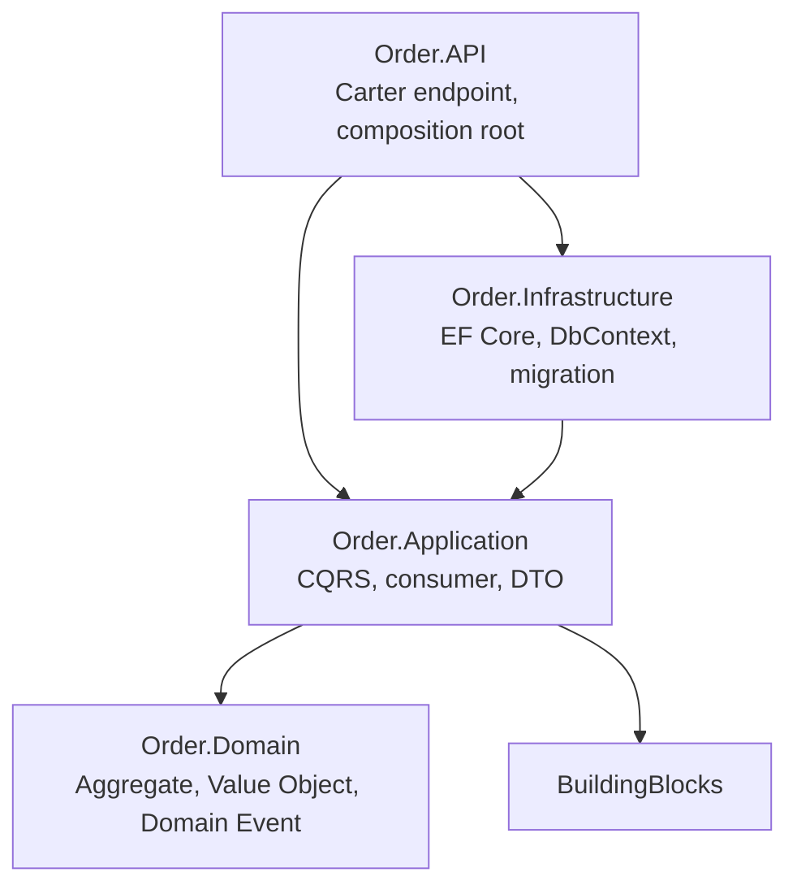
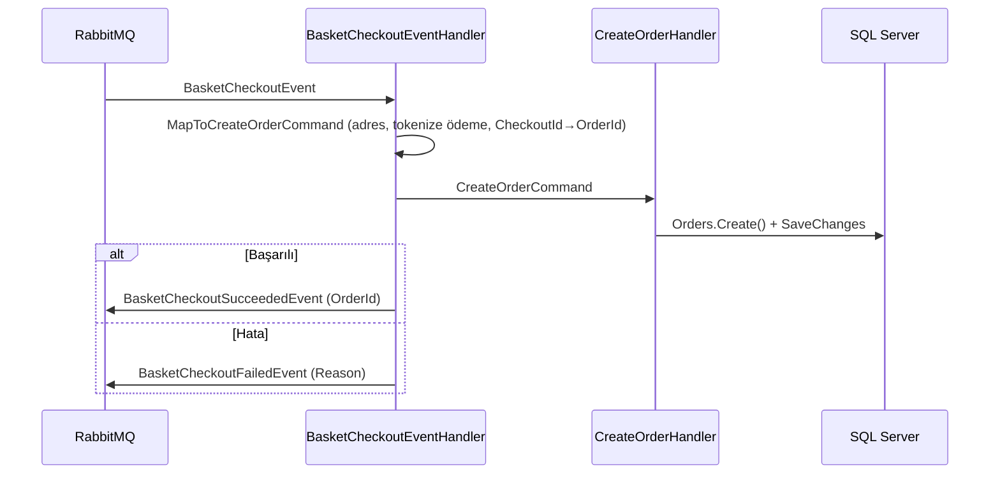

# 06 — Order Servisi

**Sorumluluk:** Sipariş CRUD ve checkout event'inden sipariş oluşturma.
**Depolama/Entegrasyon:** SQL Server (EF Core), RabbitMQ (MassTransit).
**Mimari stil:** Katmanlı Clean Architecture + DDD.
**Portlar:** Docker `6003` (HTTP) / `6063` (HTTPS), local `5003`.

---

## Katman Yapısı



Bağımlılıklar içe doğru akar; **Order.Domain dış bağımlılığa sahip değildir** (yalnızca MediatR).

---

## Order.Domain — Zengin Alan Modeli (DDD)

### Soyutlamalar — `Abstractions/`
- `Entity<T>` — kimlik (Id) + denetim alanları (CreatedAt, CreatedBy, LastModified, LastModifiedBy).
- `Aggregate<TId>` — `Entity<TId>`'yi genişletir; `List<IDomainEvent>` yönetir
  (`AddDomainEvent` / `ClearDomainEvents`).
- `IDomainEvent` — MediatR `INotification`'dan türer (EventId, OccuredOn, EventType).

### Aggregate Root — `Models/Orders.cs`

```csharp
public class Orders : Aggregate<OrderId>
{
    public IReadOnlyList<OrderItem> OrderItems { get; }
    public CustomerId CustomerId { get; private set; }
    public OrderName OrderName { get; private set; }
    public Address ShippingAddress { get; private set; }
    public Address BillingAddress { get; private set; }
    public Payment Payment { get; private set; }
    public OrderStatus Status { get; private set; }       // Draft, Pending, Completed, Cancelled
    public decimal TotalPrice { get; }                     // item'lardan hesaplanır

    public static Orders Create(...);                      // OrderCreatedEvent yükseltir
    public void Update(...);                               // OrderUpdatedEvent yükseltir
    public void Add(ProductId productId, int quantity, decimal price);
    public void Remove(ProductId productId);
}
```

### Value Object'ler — `ValueObjects/`
`OrderId`, `CustomerId`, `OrderItemId`, `ProductId` (Guid sarmalayıcı, `Of()` factory ile
non-empty doğrulama), `OrderName` (boş/whitespace doğrulaması), `Address` (ad/adres/ülke
alanları), `Payment` (kart adı, **tokenize** numara, son kullanma, redakte CVV `***`,
ödeme yöntemi). Hepsi `record`, private ctor + `Of()` factory.

> **Primitive obsession**'dan kaçınmak için güçlü tipli ID'ler kullanılır.

### Domain Event'ler — `Events/`
- `OrderCreatedEvent(Orders order)` — `Orders.Create()` ile.
- `OrderUpdatedEvent(Orders order)` — `Orders.Update()` ile.

### Enum — `OrderStatus` : `Draft=1, Pending=2, Completed=3, Cancelled=4`.

---

## Order.Application — CQRS & Event İşleme

### Commands
| Command | Result | Notlar |
|---|---|---|
| `CreateOrderCommand(OrderDto)` | `CreateOrderResult(Guid id)` | Idempotent (var olan sipariş kontrolü); eksik Customer/Product'ı otomatik oluşturur; adres/ödeme VO'larını sanitize ederek map'ler |
| `UpdateOrderCommand(OrderDto)` | `UpdateOrderResult(bool)` | `order.Update()` çağırır |
| `DeleteOrderCommand(Guid OrderId)` | `DeleteOrderResult(bool)` | |

### Queries
| Query | Result | Notlar |
|---|---|---|
| `GetOrdersQuery(PaginationRequest)` | `PaginatedResult<OrderDto>` | Skip/Take, OrderItems include |
| `GetOrdersByCustomerQuery(Guid)` | `IEnumerable<OrderDto>` | `AsNoTracking`, CustomerId filtresi |
| `GetOrdersByNameQuery(string)` | `IEnumerable<OrderDto>` | `OrderName.Value.Contains(...)` |

Tüm command'ler FluentValidation validator'larına sahiptir; `ValidationBehavior` +
`LoggingBehavior` pipeline'da otomatik uygulanır.

### DTO'lar — `DTOs/`
`OrderDto`, `OrderItemDto`, `AddressDto`, `PaymentDto`.

### Güvenlik — `Security/PaymentDataSanitizer`
Kart numarasını tokenize eder (`**** **** **** {last4}`), CVV'yi `***` olarak redakte eder.

### Domain Event Handler'ları — `OrdersCQRS/EventHandlers/Domain/`
- `OrderCreateEventHandler` — `INotificationHandler<OrderCreatedEvent>`. `OrderFullfilment`
  feature flag açıksa `OrderDto`'yu `publishEndpoint.Publish(...)` ile yayınlar.
- `OrderUpdateEventHandler` — şimdilik yalnızca loglar.

### Entegrasyon Consumer'ı — `BasketCheckoutEventHandler` (`EventHandlers/Integration/`)
`IConsumer<BasketCheckoutEvent>` implementasyonu — checkout akışının kalbidir:



- `CheckoutId` varsa `OrderId` olarak kullanılır, yoksa yeni Guid.
- Tek adres hem shipping hem billing için kullanılır.
- `PaymentToken` normalize, CVV redakte edilir.

---

## Order.Infrastructure — EF Core / SQL Server

### `ApplicationDbContext` (`IApplicationDbContext` implementasyonu)
`DbSet`'ler: `Customers`, `Products`, `Orders`, `OrdersItems`.
`OnModelCreating` → `ApplyConfigurationsFromAssembly(...)`.

### Entity Configuration'ları — `Data/Configurations/`
- `OrderConfiguration` — OrderId↔Guid dönüşümü, Customer FK, OrderItems 1-N cascade delete,
  `OrderName`/`ShippingAddress`/`BillingAddress`/`Payment` **ComplexProperty** olarak, `Status`
  string'e dönüştürülüp geri parse edilir.
- `OrderItemConfiguration`, `CustomConfiguration` (Email unique index), `ProductConfiguration`.

### Interceptor'lar — `Data/Interceptors/`
- **`AuditableEntityInterceptor`** — CreatedBy/At, LastModifiedBy/At doldurur.
- **`DispatchDomainEventsInterceptor`** — SaveChanges sırasında ChangeTracker'daki aggregate'lerin
  domain event'lerini toplar, temizler ve `mediator.Publish(...)` ile yayınlar:

```csharp
var domainEvents = context.ChangeTracker.Entries<IAggregate>()
    .Where(a => a.Entity.DomainEvents.Any())
    .SelectMany(a => a.Entity.DomainEvents).ToList();
aggregates.ForEach(a => a.ClearDomainEvents());
foreach (var domainEvent in domainEvents)
    await mediator.Publish(domainEvent);
```

### DI — `DependecyInjections.cs`
İki interceptor'ı `ISaveChangesInterceptor` olarak kaydeder, `AddDbContext` içinde ekler,
`IApplicationDbContext`'i `ApplicationDbContext`'e bağlar.

### Migration & Seeding
- Migration'lar: `20250527163957__initialCreate`, `20250922080253__orderItem_fix`.
- `DatabaseExtensions.InitialiseDatabaseAsync()` — Development'ta auto-migrate + seed
  (2 müşteri, 4 ürün, 2 sipariş).

---

## Order.API — Carter Endpoint'leri

| Metod | Route | İşlem |
|---|---|---|
| POST | `/orders` | Sipariş oluştur (201) |
| PUT | `/orders` | Sipariş güncelle |
| DELETE | `/orders/{id}` | Sipariş sil |
| GET | `/orders` | Sayfalı liste (`[AsParameters] PaginationRequest`) |
| GET | `/orders/by-customer/{customerId:guid}` | Müşteriye göre |
| GET | `/orders/by-name/{orderName}` | İsme göre |
| GET | `/health` | SQL Server sağlık kontrolü |

### Composition Root — `Program.cs`

```csharp
builder.Services
    .AddApplicationServices(builder.Configuration)      // MediatR, validator, feature mgmt, message broker
    .AddInfrastructureServices(builder.Configuration)   // EF Core + interceptor'lar
    .AddApiServices(builder.Configuration);             // Carter, exception handler, health check

var app = builder.Build();
app.UseApiServices();
if (app.Environment.IsDevelopment())
    await app.InitialiseDatabaseAsync();                // auto-migrate + seed
app.Run();
```

## Konfigürasyon (appsettings.json)

```json
{
  "ConnectionStrings": {
    "Database": "Server=localhost;Database=OrderDb;User Id=sa;Password=MyDb1234!;Encrypt=False;TrustServerCertificate=True"
  },
  "MessageBroker": { "Host": "amqp://localhost:5672", "UserName": "guest", "Password": "guest" },
  "FeatureManagement": { "OrderFullfilment": false }
}
```

## Bağımlılıklar

- **Order.Domain:** MediatR 12.4.1
- **Order.Application:** EF Core 9.0.2, Microsoft.FeatureManagement 4.0.0 + BuildingBlock(s)
- **Order.Infrastructure:** EF Core SqlServer 9.0.2, EF Core Tools 9.0.2
- **Order.API:** Carter 9.0.0, EF Core SqlServer 9.0.2, AspNetCore.HealthChecks.SqlServer 9.0.0

Devamı: [07 — Checkout Akışı](07-checkout-flow.md)
