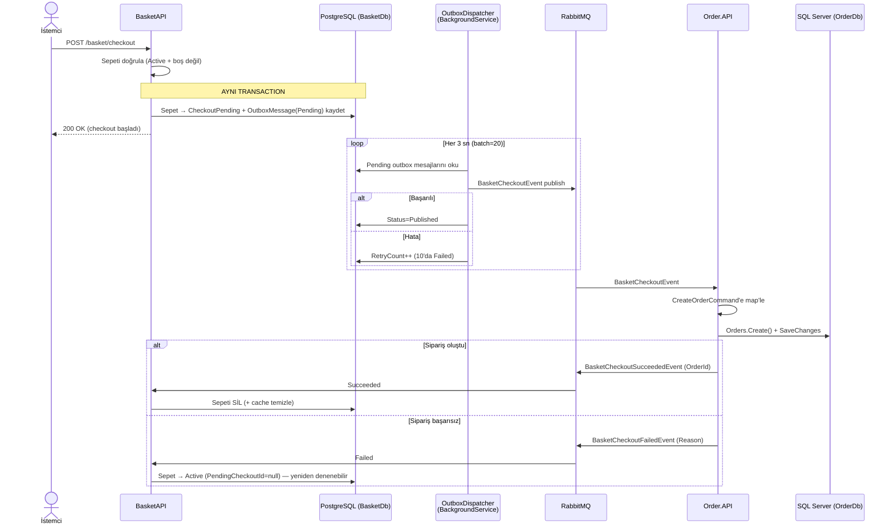

# 07 — Checkout Akışı (Outbox + Saga)

Checkout, **bilinçli olarak asenkron ve dayanıklıdır**. Broker/ağ hatalarına karşı checkout
isteğinin asla kaybolmamasını garanti eder. Bu akış sistemin en kritik parçasıdır ve
değiştirilirken bu garantiler korunmalıdır.

## Uçtan Uca Akış

## Adım Adım

1. **İstemci** → `POST /basket/checkout` (BasketAPI).
2. **Basket** sepet durumunu doğrular (`Active`, boş değil; zaten `CheckoutPending` değil).
3. Basket sepeti `CheckoutPending` yapar ve `BasketCheckoutOutboxMessage`'ı **aynı DB
   transaction'ında** kaydeder (Outbox deseni). `PendingCheckoutId` atanır.
4. **`BasketCheckoutOutboxDispatcher`** arka plan servisi bekleyen satırları okur (3 sn'de bir,
   20'lik batch) ve `BasketCheckoutEvent`'i RabbitMQ'ya publish eder.
5. **Order**, event'i tüketir → `CreateOrderCommand`'e map'ler → siparişi oluşturur.
6. Başarıda Order `BasketCheckoutSucceededEvent`, hatada `BasketCheckoutFailedEvent` yayınlar.
7. **Basket** sonucu tüketir → başarı sepeti **siler**, hata sepeti `Active`'e döndürür.

## Neden Outbox?

Eğer API çağrısından hemen sonra RabbitMQ publish başarısız olsaydı, klasik bir "publish-on-write"
yaklaşımında checkout isteği kaybolurdu. Outbox; **durum değişikliği (sepet) ile yayınlanacak
event'i tek bir atomik transaction'da** yazarak bu kaybı önler. Event ayrı bir background
süreçle, retry'lı şekilde publish edilir.

| Garanti | Mekanizma |
|---|---|
| Kayıpsızlık | Sepet + outbox mesajı aynı Marten transaction'ında |
| At-least-once teslimat | Dispatcher Pending'leri publish edilene dek yeniden dener (max 10) |
| Idempotency | Consumer'lar `PendingCheckoutId == CheckoutId` eşleşmesini kontrol eder |
| Telafi (compensation) | Hata event'i sepeti `Active`'e döndürür → yeniden denenebilir |

## İlgili Sözleşmeler (BuildingBlockMessaging)

- `BasketCheckoutEvent` — Basket → Order (CheckoutId, UserName, CustomerId, TotalPrice, Items[], adres, tokenize ödeme).
- `BasketCheckoutSucceededEvent` — Order → Basket (CheckoutId, UserName, OrderId).
- `BasketCheckoutFailedEvent` — Order → Basket (CheckoutId, UserName, Reason).

## İlgili Bileşenler

| Bileşen | Konum |
|---|---|
| Checkout endpoint + handler | BasketAPI `Basket/CheckoutBasket/` |
| Outbox mesajı / status | BasketAPI `Models/BasketCheckoutOutboxMessage.cs`, `CheckoutOutboxStatus.cs` |
| Dispatcher | BasketAPI `CheckoutSaga/BasketCheckoutOutboxDispatcher.cs` |
| Sonuç consumer'ları | BasketAPI `CheckoutSaga/BasketCheckoutResultConsumers.cs` |
| Order consumer | Order.Application `OrdersCQRS/EventHandlers/Integration/BasketCheckoutEventHandler.cs` |
| Event sözleşmeleri | `BuildingBlockMessaging/Events/` |

## Değiştirirken Dikkat

- Checkout'u senkron HTTP çağrısına "sadeleştirmeyin" — eventual consistency tasarımın amacıdır.
- Event'i API'den doğrudan publish etmeyin; **her zaman Outbox üzerinden** geçin.
- Yeni bir consumer eklerseniz MassTransit'e kaydedildiğinden emin olun, aksi halde event sessizce düşer.
- Shared event sözleşmesini değiştirmek tüm producer/consumer'ları etkiler — hepsini güncelleyin.

İlgili: [04 — Basket](04-basket-service.md) · [06 — Order](06-order-service.md) · [02 — Building Blocks](02-building-blocks.md)
