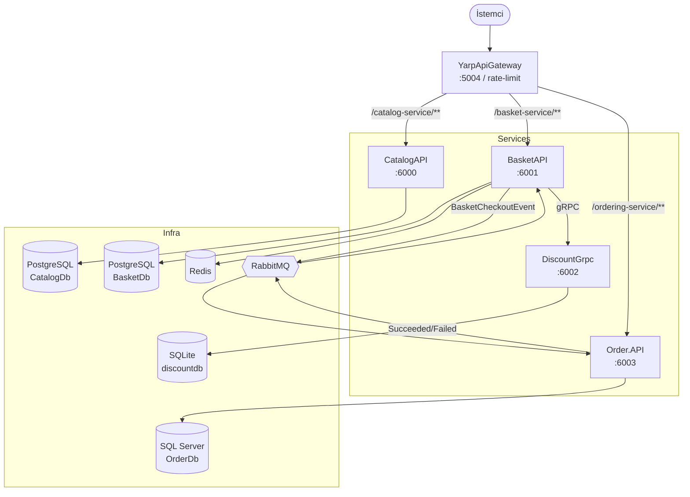

# E-Commerce Microservices — Mimari Dokümantasyonu

Bu dizin, `ECommerce_Microservices` çözümünün mimarisini ayrıntılı olarak belgeler.
**.NET 9** üzerine kurulu, servis düzeyinde veri sahipliği, senkron (HTTP/gRPC) ve asenkron
(RabbitMQ / MassTransit) iletişim, dayanıklı checkout orkestrasyonu (Outbox + Saga) ve
MediatR ile CQRS desenlerini gösteren modüler bir e-ticaret backend'idir.

## İçindekiler

| # | Belge | Konu |
|---|---|---|
| 01 | [Sistem Genel Bakış](01-system-overview.md) | Servisler, sınırlar, iletişim modelleri, teknoloji yığını |
| 02 | [Building Blocks (Paylaşılan Katman)](02-building-blocks.md) | CQRS soyutlamaları, pipeline davranışları, exception yönetimi, mesajlaşma altyapısı |
| 03 | [Catalog Servisi](03-catalog-service.md) | Ürün CRUD, Marten/PostgreSQL, vertical slice |
| 04 | [Basket Servisi](04-basket-service.md) | Sepet, Redis cache, gRPC istemcisi, Outbox |
| 05 | [Discount Servisi (gRPC)](05-discount-service.md) | Kupon yönetimi, gRPC, EF Core/SQLite |
| 06 | [Order Servisi](06-order-service.md) | Clean Architecture, DDD, EF Core/SQL Server |
| 07 | [Checkout Akışı (Outbox + Saga)](07-checkout-flow.md) | Uçtan uca eventual-consistent checkout |
| 08 | [Gateway & Dağıtım](08-gateway-and-deployment.md) | YARP gateway, rate limiting, docker-compose, portlar |
| 09 | [Test Stratejisi](09-testing.md) | xUnit, Moq, katman bazlı test yaklaşımı |

## Hızlı Mimari Şema

## Mimarinin Temel İlkeleri

- **Servis veri sahipliği:** Her servis kendi veritabanına sahiptir; başka bir servisin DB'sini doğrudan okumaz.
- **İki yapısal stil bir arada:** Catalog/Basket/Discount → vertical slice; Order → katmanlı Clean Architecture.
- **Senkron + Asenkron iletişim:** HTTP & gRPC (senkron), RabbitMQ/MassTransit (asenkron).
- **Dayanıklı checkout:** Outbox + Saga ile broker/ağ hatalarına karşı kayıpsız checkout.
- **CQRS + MediatR:** Her yazma bir Command, her okuma bir Query üzerinden geçer; pipeline davranışları doğrulama ve loglama yapar.

> Bu dokümantasyon kaynağı koddan üretilmiştir. Kod ile çelişki olursa kod esastır.
