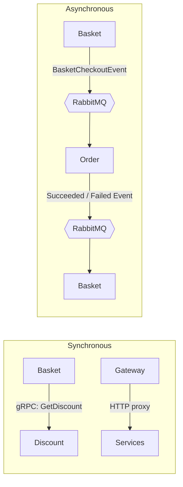

# 01 — System Overview

## Purpose

`ECommerce_Microservices` is a reference application demonstrating the core patterns of
microservice architecture on the modern .NET 9 ecosystem:

- Service-level data ownership (database-per-service)
- Synchronous communication: HTTP (Minimal API + Carter) and gRPC
- Asynchronous communication: integration events via MassTransit over RabbitMQ
- Resilient, eventually-consistent checkout orchestration (Outbox + Saga / choreography)
- CQRS with MediatR, FluentValidation, Mapster, pipeline behaviors

## Services

| Service | Responsibility | Storage / Integration | Architectural Style | Docker Port | Local HTTP Port |
|---|---|---|---|---|---|
| **CatalogAPI** | Product CRUD & browsing | PostgreSQL (Marten) | Vertical slice | 6000 | 5000 |
| **BasketAPI** | Basket CRUD, discount-aware pricing, checkout start | PostgreSQL (Marten), Redis, gRPC client, RabbitMQ | Vertical slice | 6001 | 5001 |
| **DiscountGrpc** | Coupon management (gRPC) | SQLite (EF Core) | gRPC service | 6002 | 5002 |
| **Order.API** | Order CRUD, lifecycle, returns, order-from-event | SQL Server (EF Core), RabbitMQ | Clean Architecture | 6003 | 5003 |
| **UsersAPI** | Profile, addresses, favorites (JIT provisioning) | PostgreSQL (Marten) | Vertical slice | 6004 | — |
| **PaymentAPI** | Mock payment/refund (capture/refund) | PostgreSQL (Marten), RabbitMQ | Vertical slice (consumer) | 6005 | — |
| **YarpApiGateway** | Reverse proxy + rate limiting + edge authz | Proxies to services | (in compose) | 5004 |

> **Infrastructure containers:** PostgreSQL ×4 (Catalog/Basket/Users/Payment), SQL Server (Order), Redis,
> RabbitMQ, **Keycloak** (identity, `:8088`), **Seq** (logs, `:8081`), **Aspire Dashboard** (traces/metrics, `:18888`).
> The gateway is now part of docker-compose.
>
> **Identity & security (FEAT-001):** Keycloak (OIDC/JWT); services + gateway validate JWT; protected
> endpoints use `RequireAuthorization`. Details: [../specs/features/001-identity-users/IMPLEMENTATION.md](../specs/features/001-identity-users/IMPLEMENTATION.md).

## Architectural Styles — Two Approaches Coexist

The solution deliberately hosts two distinct structural styles. When writing new code, the
style used by the target service must be preserved.

### 1. Vertical Slice (Catalog / Basket / Discount)
Within a single API project, each feature lives in its own folder: endpoint + command/query +
handler + validator + response together. Features are independent of one another.

```
Products/
  CreateProduct/
    CreateProductEndpoint.cs
    CreateProductCommandHandler.cs   # command + validator + result + handler in the same file
```

### 2. Layered Clean Architecture (Order)
Responsibilities are split across four projects; dependencies flow inward:

```
Order.API            → Order.Application, Order.Infrastructure   (presentation / composition root)
Order.Infrastructure → Order.Application                          (EF Core, persistence)
Order.Application    → Order.Domain, BuildingBlocks               (CQRS, business logic)
Order.Domain         → (no external dependencies, only MediatR)   (aggregate, VO, event)
```

## Communication Models



| Type | Technology | Usage |
|---|---|---|
| Synchronous (request/response) | HTTP (Minimal API + Carter) | Client ↔ service, gateway proxy |
| Synchronous (low-latency, contract-first) | gRPC | Basket → Discount coupon pricing |
| Asynchronous (event-driven) | RabbitMQ + MassTransit | Checkout flow, loose coupling between services |

## Technology Stack

- **.NET 9**, **Minimal API** + **Carter** modules (`ICarterModule`)
- **MediatR** — commands & queries; pipeline behaviors live in `BuildingBlock`
- **FluentValidation** — one validator per command, auto-invoked by the validation behavior
- **Mapster** — object mapping (`.Adapt<T>()`)
- **Marten** (document DB over PostgreSQL) — Catalog & Basket
- **EF Core** — Order (SQL Server) & Discount (SQLite)
- **MassTransit + RabbitMQ** — integration events
- **Redis** — read-through cache in Basket (decorator pattern)
- **YARP** — gateway, route config + fixed-window rate limiter
- **Serilog** — structured (JSON) logging
- **Polly** — retry for transient failures in Catalog seeding
- **Health checks** — `GET /health` for Catalog, Basket, Order

## Repository Layout

```text
ECommerce_Microservices/
├── Src/
│   ├── ApiGateways/YarpApiGateway/
│   ├── BuildingBlocks/
│   │   ├── BuildingBlock/            # CQRS abstractions, behaviors, exceptions, pagination
│   │   └── BuildingBlockMessaging/   # integration events, MassTransit registration helpers
│   └── Services/
│       ├── CatalogAPI/               # Minimal API + Carter + Marten (vertical slice)
│       ├── Basket/BasketAPI/         # + Redis + gRPC client + Outbox
│       ├── DiscountGrpc/             # gRPC + EF Core (SQLite)
│       └── Order/
│           ├── Order.API/            # Carter endpoints, composition root
│           ├── Order.Application/    # MediatR handlers, DTOs, validators, consumers
│           ├── Order.Domain/         # entities, value objects, domain events, abstractions
│           └── Order.Infrastructure/ # EF Core DbContext, configurations, migrations
├── Tests/ECommerce_Tests/            # xUnit + Moq
├── docker-compose.yml
└── docker-compose.override.yml
```

Next: [02 — Building Blocks](02-building-blocks.md)
