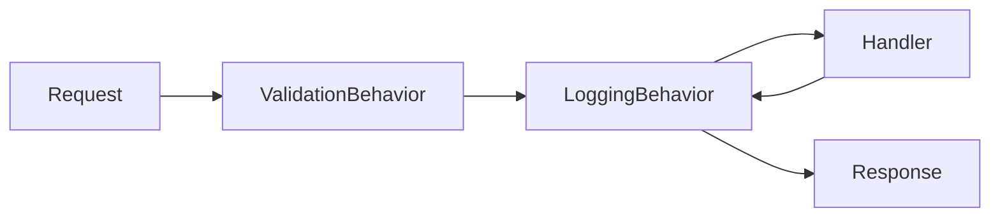

# 02 — Building Blocks (Shared Layer)

Under `Src/BuildingBlocks` there are two projects shared by all services:

- **BuildingBlock** — CQRS abstractions, MediatR pipeline behaviors, exception handling, pagination.
- **BuildingBlockMessaging** — integration event contracts and the MassTransit registration helper.

---

## BuildingBlock

### CQRS Abstractions

`CQRS/ICommand.cs`, `CQRS/IQuery.cs`, and `CQRS/Handlers/` establish a thin contract layer over MediatR:

```csharp
// Command — write operations
public interface ICommand : ICommand<Unit> { }
public interface ICommand<out TResponse> : IRequest<TResponse> { }

// Query — read operations
public interface IQuery<TResponse> : IRequest<TResponse> where TResponse : notnull { }

// Handlers
public interface ICommandHandler<in TCommand>
    : ICommandHandler<TCommand, Unit> where TCommand : ICommand<Unit> { }

public interface ICommandHandler<in TCommand, TResponse>
    : IRequestHandler<TCommand, TResponse>
    where TCommand : ICommand<TResponse> where TResponse : notnull { }

public interface IQueryHandler<in TQuery, TResponse>
    : IRequestHandler<TQuery, TResponse>
    where TQuery : IQuery<TResponse> where TResponse : notnull { }
```

**Convention:** Commands end in `Command`, queries in `Query`, handlers in `Handler`;
responses/DTOs are `record` types.

### Pipeline Behaviors

Every MediatR request passes through a behavior chain before reaching the handler:



#### ValidationBehavior — `Behaviors/ValidationBehavior.cs`
Runs all `IValidator<TRequest>` registered for the request type **in parallel**; if any fail,
it throws a `ValidationException` before the handler is ever reached.

```csharp
var failures = validationResults
    .Where(r => r.Errors.Any())
    .SelectMany(r => r.Errors)
    .ToList();
if (failures.Any())
    throw new ValidationException(failures);
return await next();
```

#### LoggingBehavior — `Behaviors/LoggingBehavior.cs`
Logs the request/response, measures duration with a `Stopwatch`, emits a `[PERFORMANCE]`
warning for requests exceeding **3 seconds**, and on error logs with the payload before rethrowing.

> Both behaviors are registered as open generics via `config.AddOpenBehavior(typeof(...<,>))`
> in each service's `Program.cs` / DI registration.

### Exception Handling

Application exception types are defined under `Exceptions/`:

| Exception | HTTP Status |
|---|---|
| `NotFoundExceptions` | 404 Not Found |
| `BadRequestException` | 400 Bad Request |
| `ValidationException` (FluentValidation) | 400 Bad Request (+ `ValidationError` detail) |
| `InternalServerException` | 500 Internal Server Error |
| Other | 500 Internal Server Error |

#### CustomExceptionHandler — `Exceptions/Handlers/CustomExceptionHandler.cs`
An `IExceptionHandler` implementation; it maps the exception to a `ProblemDetails` object,
adds a `traceId`, and for `ValidationException` adds the error list as a `ValidationError`
extension before returning JSON. Enabled in services via `AddExceptionHandler<CustomExceptionHandler>()`
+ `UseExceptionHandler(...)`.

### Pagination — `Pagination/`

```csharp
public record PaginationRequest(int PageIndex = 0, int PageSize = 10);

public class PaginatedResult<TEntity>(int pageIndex, int pageSize, long count, IEnumerable<TEntity> data)
    where TEntity : class
{
    public int PageIndex { get; }
    public int PageSize { get; }
    public IEnumerable<TEntity> Data { get; }
    public long Count { get; }
}
```

The Order service's `GetOrders` query uses this generic pagination type.

---

## BuildingBlockMessaging

### IntegrationEvent Base Type — `Events/IntegrationEvent.cs`

```csharp
public record IntegrationEvent
{
    public Guid id => Guid.NewGuid();
    public DateTime OccuredOn => DateTime.UtcNow;
    public string EventType => GetType().AssemblyQualifiedName;
}
```

All integration events inherit this record. Contracts live centrally here; **changing an
event is a breaking change that affects all producers/consumers.**

### Integration Event Contracts

| Event | Produced by | Consumed by | Content (summary) |
|---|---|---|---|
| `BasketCheckoutEvent` | Basket (Outbox) | Order | CheckoutId, UserName, CustomerId, TotalPrice, Items[], address fields, tokenized payment |
| `BasketCheckoutSucceededEvent` | Order | Basket | CheckoutId, UserName, OrderId |
| `BasketCheckoutFailedEvent` | Order | Basket | CheckoutId, UserName, Reason |
| `BasketCheckoutItemEvent` | (sub-object) | — | ProductId, ProductName, Quantity, Price |

```csharp
public record BasketCheckoutEvent : IntegrationEvent
{
    public Guid CheckoutId { get; set; }
    public string UserName { get; set; }
    public Guid CustomerId { get; set; }
    public decimal TotalPrice { get; set; }
    public List<BasketCheckoutItemEvent> Items { get; set; } = [];

    // Shipping + Billing address fields
    public string FirstName, LastName, EmailAddress, AddressLine, Country, State, ZipCode { get; set; }

    // Tokenized payment details — raw PAN/CVV is never transported
    public string CardName, PaymentToken, PaymentReference, CardLast4, CardBrand { get; set; }
    public int PaymentMethod { get; set; }
}
```

> **Security note:** The event carries only tokenized payment data (PaymentToken, CardLast4,
> CardBrand); the raw card number / CVV is never transported.

### MassTransit Registration — `MassTransit/Extentions.cs`

```csharp
public static IServiceCollection AddMessageBroker(
    this IServiceCollection service, IConfiguration configuration, Assembly? assembly = null)
{
    service.AddMassTransit(config =>
    {
        config.SetKebabCaseEndpointNameFormatter();

        // Consumers are scanned only in the consuming service (reflection).
        if (assembly is not null)
            config.AddConsumers(assembly);

        config.UsingRabbitMq((context, configurator) =>
        {
            configurator.Host(new Uri(configuration["MessageBroker:Host"]!), host =>
            {
                host.Username(configuration["MessageBroker:UserName"]!);
                host.Password(configuration["MessageBroker:Password"]!);
            });
            configurator.ConfigureEndpoints(context);
        });
    });
    return service;
}
```

**Important details:**
- **Kebab-case endpoint naming:** Queue names are automatically converted to kebab-case.
- **Assembly parameter:** Only consuming services (Basket, Order) pass `assembly`, so MassTransit
  can discover and register `IConsumer<>` classes. Publish-only services do not pass it.
- **Common mistake:** If a new consumer is added but not registered, events are silently dropped.

Next: [03 — Catalog Service](03-catalog-service.md)
