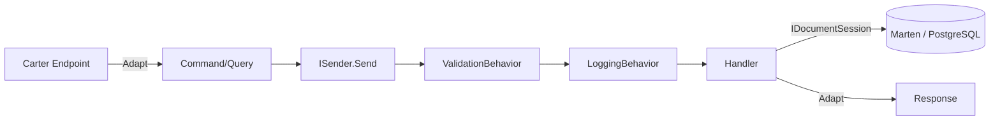

# 03 — Catalog Service

**Responsibility:** Product CRUD and browsing.
**Storage:** PostgreSQL (Marten document DB).
**Architectural style:** Vertical slice (each feature in its own folder).
**Ports:** Docker `6000` (HTTP) / `6060` (HTTPS), local `5000`.

---

## Folder Structure

```text
CatalogAPI/
├── Products/
│   ├── GetProducts/            GetProductsEndpoint.cs + GetProductsQueryHandler.cs
│   ├── GetProductById/         GetProductByIdEndpoint.cs + GetProductByIdQueryHandler.cs
│   ├── GetProductByCategory/   GetProductByCategoryEndpoint.cs + GetProductByCategoryHandler.cs
│   ├── CreateProduct/          CreateProductEndpoint.cs + CreateProductCommandHandler.cs
│   ├── UpdateProdcut/          UpdateProductEndpoint.cs + UpdateProductCommandHandler.cs  (folder name has a typo)
│   └── DeleteProduct/          DeleteProductEndpoint.cs + DeleteProductCommandHandler.cs
├── Models/Entities/Product.cs
├── Exceptions/ProductNotFoundException.cs
├── InitialData/CatalogInitialData.cs
└── Program.cs
```

## Endpoints

| Method | Route | Operation | Response |
|---|---|---|---|
| GET | `/products` | Paginated product list (PageNumber, PageSize) | `GetProductsResponse` |
| GET | `/products/{id}` | Product by ID; 404 if missing | `GetProductByIdResponse` |
| GET | `/products/category/{category}` | Filter by category | `GetProductByCategoryResponse` |
| POST | `/product-create` | Create product | 201 + `CreateProductResponse(Guid Id)` |
| PUT | `/product-update` | Update product; 404 if missing | `UpdateProductResponse(bool)` |
| DELETE | `/product-delete/{id}` | Delete product | `DeleteProductResponse(bool)` |
| GET | `/health` | PostgreSQL health check | HealthCheck UI JSON |

## Request Processing Flow (Vertical Slice + CQRS)



A typical endpoint (CreateProduct):

```csharp
app.MapPost("/product-create", async (CreateProductRequest request, ISender sender) =>
{
    var command = request.Adapt<CreateProductCommand>();
    var result  = await sender.Send(command);
    var response = result.Adapt<CreateProductResponse>();
    return Results.Created($"/products/{response.Id}", response);
});
```

## CQRS Details

Each slice contains a **record command/query + result**, a **FluentValidation validator**
(for write operations), and a **handler**.

```csharp
public record CreateProductCommand(Guid Id, string Name, List<string> Category,
    string Description, string ImageFile, decimal Price) : ICommand<CreateProductResult>;

public class CreateProductCommandValidator : AbstractValidator<CreateProductCommand>
{
    public CreateProductCommandValidator()
    {
        RuleFor(x => x.Name).NotEmpty();
        RuleFor(x => x.Category).NotEmpty();
        RuleFor(x => x.ImageFile).NotEmpty();
        RuleFor(x => x.Price).GreaterThan(0);
    }
}

internal class CreateProductCommandHandler(IDocumentSession session)
    : ICommandHandler<CreateProductCommand, CreateProductResult>
{
    public async Task<CreateProductResult> Handle(CreateProductCommand cmd, CancellationToken ct)
    {
        var product = new Product { /* ... */ };
        session.Store(product);
        await session.SaveChangesAsync(ct);
        return new CreateProductResult(product.Id);
    }
}
```

- **GetProductById** → throws `ProductNotFoundException` (404) if missing.
- **GetProductByCategory** → `Where(p => p.Category.Contains(query.Category))`.
- **GetProducts** → pagination via Marten's `.ToPagedListAsync(...)`.

## Data Model — `Models/Entities/Product.cs`

```csharp
public class Product
{
    public Guid Id { get; set; }
    public string Name { get; set; } = default!;
    public List<string> Category { get; set; } = new();
    public string Description { get; set; } = default!;
    public string ImageFile { get; set; } = default!;
    public decimal Price { get; set; }
}
```

## Persistence — Marten / PostgreSQL

```csharp
var connString = builder.Configuration.GetConnectionString("PostgreDataBase");
builder.Services.AddMarten(options => options.Connection(connString))
                .UseLightweightSessions();

if (builder.Environment.IsDevelopment())
    builder.Services.InitializeMartenWith<CatalogInitialData>();
```

- **Lightweight sessions:** Performant document access without change tracking.
- **Connection (local):** `Server=localhost;Port=5432;Database=CatalogDb;User Id=postgres;Password=postgres`.
- **Seeding:** `CatalogInitialData` (Development), 7 predefined products; **Polly** retries on
  transient connection errors (Npgsql/Socket) at 2s/5s/10s. Skips if products exist (idempotent).

## Cross-Cutting Concerns

- **Serilog:** Compact JSON to console with `ServiceName=CatalogAPI` enrichment; `UseSerilogRequestLogging()`.
- **CustomExceptionHandler:** Consistent `ProblemDetails` error responses.
- **Health checks:** `AddNpgSql(...)` → `GET /health`.

## Dependencies (CatalogAPI.csproj)

`Carter 9.0.0`, `Marten 7.38.1`, `AspNetCore.HealthChecks.NpgSql 9.0.0`,
`AspNetCore.HealthChecks.UI.Client 9.0.0`, `Polly 8.6.5`, `Serilog.AspNetCore 9.0.0`,
`Microsoft.AspNetCore.OpenApi 9.0.2`. MediatR/FluentValidation/Mapster come via `BuildingBlock`.

Next: [04 — Basket Service](04-basket-service.md)
