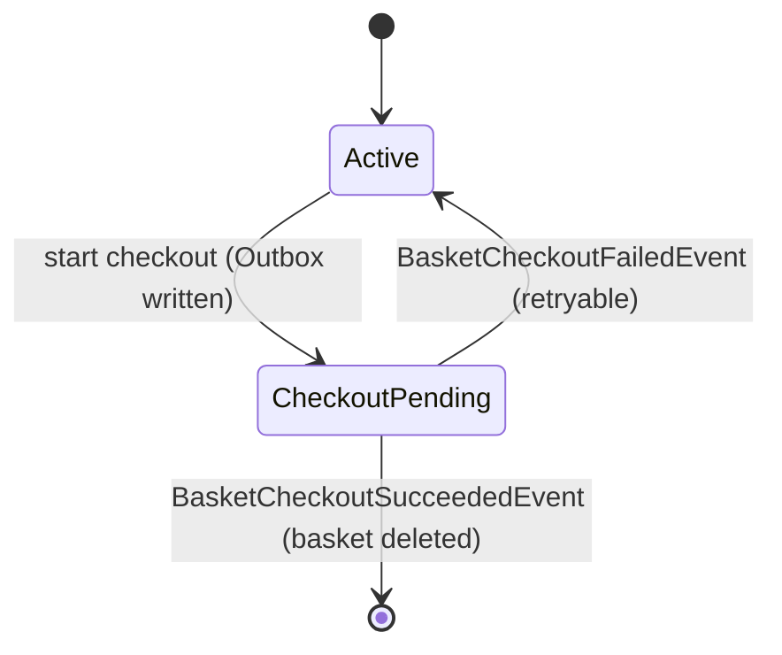

# 04 — Basket Service

**Responsibility:** Basket CRUD, discount-aware pricing, checkout start.
**Storage/Integration:** PostgreSQL (Marten), Redis (cache), gRPC client to Discount, RabbitMQ (MassTransit).
**Architectural style:** Vertical slice + Outbox/Saga.
**Ports:** Docker `6001` (HTTP) / `6061` (HTTPS), local `5001`.

---

## Folder Structure

```text
BasketAPI/
├── Basket/
│   ├── GetBasket/        endpoint + GetBasketQueryHandler
│   ├── StoreBasket/      endpoint + StoreBasketCommandHandler  (Discount gRPC call)
│   ├── DeleteBasket/     endpoint + DeleteBasketCommandHandler
│   └── CheckoutBasket/   endpoint + CheckoutBasketHandler      (Outbox write)
├── CheckoutSaga/
│   ├── BasketCheckoutOutboxDispatcher.cs   (BackgroundService)
│   └── BasketCheckoutResultConsumers.cs    (Succeeded/Failed consumers)
├── Data/
│   ├── Abstracts/IBasketRepository.cs
│   ├── BasketRepository.cs                 (Marten)
│   └── CachedBasketRepository.cs           (Redis decorator)
├── Models/  ShoppingCard, ShoppingCardItem, BasketStatus,
│            BasketCheckoutOutboxMessage, CheckoutOutboxStatus
├── DTOs/BasketCheckoutDto.cs
├── Protos/discount.proto                   (GrpcServices="Client")
└── Program.cs
```

## Endpoints

| Method | Route | Operation |
|---|---|---|
| GET | `/basket/{userName}` | Get basket (Redis first, then DB) |
| POST | `/basket-store` | Save/update basket; deduct discount via Discount gRPC |
| DELETE | `/basket/{userName}` | Delete basket from DB + cache |
| POST | `/basket/checkout` | Start checkout: validate → write Outbox message → set basket to `CheckoutPending` |
| GET | `/health` | PostgreSQL + Redis health check |

## Data Model

```csharp
public class ShoppingCard
{
    public string UserName { get; set; } = default!;          // Marten document identity
    public List<ShoppingCardItem> Items { get; set; } = new();
    public BasketStatus Status { get; set; } = BasketStatus.Active;
    public Guid? PendingCheckoutId { get; set; }              // tracks in-flight checkout
    public decimal TotalPrice => Items.Sum(x => x.Price * x.Quantity);  // computed
}

public class ShoppingCardItem
{
    public int Quantity { get; set; }
    public string Color { get; set; } = default!;
    public decimal Price { get; set; }      // price after discount deduction
    public Guid ProductId { get; set; }
    public string ProductName { get; set; } = default!;
}

public enum BasketStatus { Active = 0, CheckoutPending = 1 }
```

### Basket State Machine



## Persistence — Marten + Repository + Redis Decorator

```csharp
builder.Services.AddMarten(opts =>
{
    opts.Connection(builder.Configuration.GetConnectionString("PostgreDataBase")!);
    opts.Schema.For<ShoppingCard>().Identity(x => x.UserName);
    opts.Schema.For<BasketCheckoutOutboxMessage>().Identity(x => x.Id);
});

builder.Services.AddStackExchangeRedisCache(options =>
{
    options.Configuration = builder.Configuration.GetConnectionString("Redis");
    options.InstanceName = "Basket";
});

builder.Services.AddScoped<IBasketRepository, BasketRepository>();
builder.Services.Decorate<IBasketRepository, CachedBasketRepository>();  // Scrutor
```

**Decorator pattern (Scrutor):** Resolution chain
`IBasketRepository → CachedBasketRepository (outer) → BasketRepository (inner)`.

```csharp
public class CachedBasketRepository(IBasketRepository repository, IDistributedCache cache) : IBasketRepository
{
    public async Task<ShoppingCard> GetBasket(string userName, CancellationToken ct = default)
    {
        var cached = await cache.GetStringAsync(userName, ct);
        if (!string.IsNullOrEmpty(cached))
            return JsonSerializer.Deserialize<ShoppingCard>(cached);

        var basket = await repository.GetBasket(userName, ct);          // read-through
        await cache.SetStringAsync(userName, JsonSerializer.Serialize(basket), ct);
        return basket;
    }
    // StoreBasket → update DB + cache; DeleteBasket → delete DB + cache
}
```

## gRPC Integration — Calling Discount

During `StoreBasket`, a coupon is fetched from the Discount service for each item and deducted from the price:

```csharp
builder.Services.AddGrpcClient<DiscountProtoService.DiscountProtoServiceClient>(o =>
    o.Address = new Uri(builder.Configuration["GrpcSettings:DiscountUrl"]!))
  .ConfigurePrimaryHttpMessageHandler(() => /* accept self-signed cert in Dev */);

// Inside StoreBasketCommandHandler:
private async Task DeductDiscount(ShoppingCard cart, CancellationToken ct)
{
    foreach (var item in cart.Items)
    {
        var coupon = await discountProto.GetDiscountAsync(
            new GetDiscountRequest { ProductName = item.ProductName }, cancellationToken: ct);
        item.Price -= coupon.Amount;
    }
}
```

> Kestrel is configured with `Http1AndHttp2` (required for gRPC). See [05 — Discount](05-discount-service.md).

## Outbox Pattern

```csharp
public class BasketCheckoutOutboxMessage
{
    public Guid Id { get; set; } = Guid.NewGuid();
    public Guid CheckoutId { get; set; }
    public string UserName { get; set; } = default!;
    public BasketCheckoutEvent Payload { get; set; } = default!;
    public CheckoutOutboxStatus Status { get; set; } = CheckoutOutboxStatus.Pending;
    public int RetryCount { get; set; }
    public string? LastError { get; set; }
    public DateTime CreatedAt { get; set; } = DateTime.UtcNow;
    public DateTime? PublishedAt { get; set; }
}

public enum CheckoutOutboxStatus { Pending = 0, Published = 1, Failed = 2 }
```

### Checkout Handler — Atomic Write

`CheckoutBasketHandler` loads the basket, validates it (non-empty + not already pending),
prepares the event, and persists the **basket state + outbox message in the same Marten transaction**:

```csharp
basket.Status = BasketStatus.CheckoutPending;
basket.PendingCheckoutId = checkoutId;

session.Store(basket);
session.Store(outboxMessage);
await session.SaveChangesAsync(ct);   // single transaction → losslessness guarantee
```

### Dispatcher — `BasketCheckoutOutboxDispatcher` (BackgroundService)

Every 3 seconds reads `Pending` messages (batch of up to 20) and publishes them to RabbitMQ:

```csharp
foreach (var message in pendingMessages)
{
    try
    {
        await publishEndpoint.Publish(message.Payload, ct);
        message.Status = CheckoutOutboxStatus.Published;
        message.PublishedAt = DateTime.UtcNow;
    }
    catch (Exception ex)
    {
        message.RetryCount++;
        message.LastError = ex.Message;
        if (message.RetryCount >= 10) message.Status = CheckoutOutboxStatus.Failed;  // MaxRetry=10
    }
    session.Store(message);
}
await session.SaveChangesAsync(ct);
```

## Result Consumers — `BasketCheckoutResultConsumers.cs`

Both consumers check `basket.PendingCheckoutId == message.CheckoutId` (idempotency / ignore the wrong event):

- **`BasketCheckoutSucceededEventConsumer`** → **deletes** the basket from DB + cache (order created).
- **`BasketCheckoutFailedEventConsumer`** → resets the basket to `Active`, sets `PendingCheckoutId = null`
  (retryable), updates cache, logs a warning.

## Program.cs Summary

MediatR (+ Validation/Logging behaviors), FluentValidation, Carter, Marten,
`AddStackExchangeRedisCache`, repository + Scrutor decorator, `AddGrpc()` + gRPC client,
`AddMessageBroker(config, assembly)` (consumers scanned from this assembly),
`AddHostedService<BasketCheckoutOutboxDispatcher>()`, health checks (NpgSql + Redis),
`CustomExceptionHandler`.

## Dependencies (BasketAPI.csproj)

`Carter 9.0.0`, `Marten 7.37.1`, `MassTransit 8.4.0`,
`Microsoft.Extensions.Caching.StackExchangeRedis 9.0.2`, `Scrutor 6.0.1`,
`Grpc.AspNetCore 2.67.0` / `Grpc.Net.Client 2.67.0` / `Grpc.Tools 2.69.0` / `Google.Protobuf 3.29.3`,
`AspNetCore.HealthChecks.NpgSql/Redis 9.0.0`. Project references: `BuildingBlock`, `BuildingBlockMessaging`.

Next: [05 — Discount Service](05-discount-service.md) · Full flow: [07 — Checkout Flow](07-checkout-flow.md)
