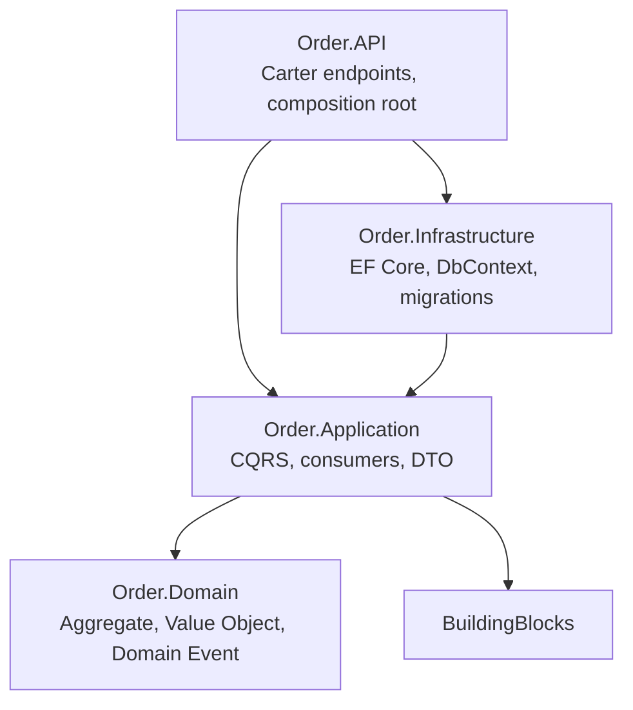
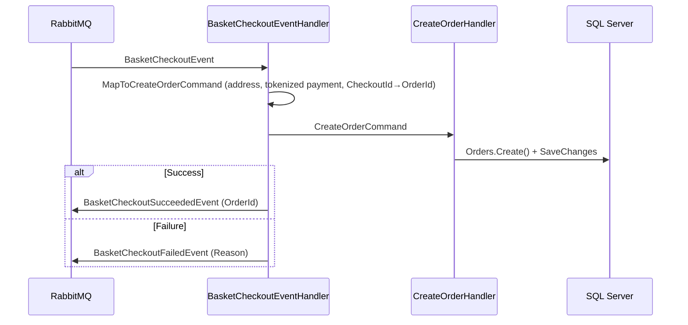

# 06 — Order Service

**Responsibility:** Order CRUD and order creation from the checkout event.
**Storage/Integration:** SQL Server (EF Core), RabbitMQ (MassTransit).
**Architectural style:** Layered Clean Architecture + DDD.
**Ports:** Docker `6003` (HTTP) / `6063` (HTTPS), local `5003`.

---

## Layer Structure



Dependencies flow inward; **Order.Domain has no external dependencies** (only MediatR).

---

## Order.Domain — Rich Domain Model (DDD)

### Abstractions — `Abstractions/`
- `Entity<T>` — identity (Id) + audit fields (CreatedAt, CreatedBy, LastModified, LastModifiedBy).
- `Aggregate<TId>` — extends `Entity<TId>`; manages `List<IDomainEvent>`
  (`AddDomainEvent` / `ClearDomainEvents`).
- `IDomainEvent` — derives from MediatR's `INotification` (EventId, OccuredOn, EventType).

### Aggregate Root — `Models/Orders.cs`

```csharp
public class Orders : Aggregate<OrderId>
{
    public IReadOnlyList<OrderItem> OrderItems { get; }
    public CustomerId CustomerId { get; private set; }
    public OrderName OrderName { get; private set; }
    public Address ShippingAddress { get; private set; }
    public Address BillingAddress { get; private set; }
    public Payment Payment { get; private set; }
    public OrderStatus Status { get; private set; }       // Draft, Pending, Completed, Cancelled
    public decimal TotalPrice { get; }                     // computed from items

    public static Orders Create(...);                      // raises OrderCreatedEvent
    public void Update(...);                               // raises OrderUpdatedEvent
    public void Add(ProductId productId, int quantity, decimal price);
    public void Remove(ProductId productId);
}
```

### Value Objects — `ValueObjects/`
`OrderId`, `CustomerId`, `OrderItemId`, `ProductId` (Guid wrappers with non-empty validation via
an `Of()` factory), `OrderName` (empty/whitespace validation), `Address` (name/address/country
fields), `Payment` (card name, **tokenized** number, expiration, redacted CVV `***`, payment
method). All are `record`s with a private ctor + `Of()` factory.

> Strongly-typed IDs are used to avoid **primitive obsession**.

### Domain Events — `Events/`
- `OrderCreatedEvent(Orders order)` — via `Orders.Create()`.
- `OrderUpdatedEvent(Orders order)` — via `Orders.Update()`.

### Enum — `OrderStatus`: `Draft=1, Pending=2, Completed=3, Cancelled=4`.

---

## Order.Application — CQRS & Event Handling

### Commands
| Command | Result | Notes |
|---|---|---|
| `CreateOrderCommand(OrderDto)` | `CreateOrderResult(Guid id)` | Idempotent (checks for existing order); auto-creates missing Customer/Product; maps address/payment VOs with sanitization |
| `UpdateOrderCommand(OrderDto)` | `UpdateOrderResult(bool)` | Calls `order.Update()` |
| `DeleteOrderCommand(Guid OrderId)` | `DeleteOrderResult(bool)` | |

### Queries
| Query | Result | Notes |
|---|---|---|
| `GetOrdersQuery(PaginationRequest)` | `PaginatedResult<OrderDto>` | Skip/Take, includes OrderItems |
| `GetOrdersByCustomerQuery(Guid)` | `IEnumerable<OrderDto>` | `AsNoTracking`, CustomerId filter |
| `GetOrdersByNameQuery(string)` | `IEnumerable<OrderDto>` | `OrderName.Value.Contains(...)` |

All commands have FluentValidation validators; `ValidationBehavior` + `LoggingBehavior` are
applied automatically in the pipeline.

### DTOs — `DTOs/`
`OrderDto`, `OrderItemDto`, `AddressDto`, `PaymentDto`.

### Security — `Security/PaymentDataSanitizer`
Tokenizes the card number (`**** **** **** {last4}`), redacts the CVV to `***`.

### Domain Event Handlers — `OrdersCQRS/EventHandlers/Domain/`
- `OrderCreateEventHandler` — `INotificationHandler<OrderCreatedEvent>`. If the `OrderFullfilment`
  feature flag is on, publishes the `OrderDto` via `publishEndpoint.Publish(...)`.
- `OrderUpdateEventHandler` — currently only logs.

### Integration Consumer — `BasketCheckoutEventHandler` (`EventHandlers/Integration/`)
An `IConsumer<BasketCheckoutEvent>` implementation — the heart of the checkout flow:



- If `CheckoutId` is present it is used as the `OrderId`, otherwise a new Guid.
- A single address is used for both shipping and billing.
- `PaymentToken` is normalized and the CVV is redacted.

---

## Order.Infrastructure — EF Core / SQL Server

### `ApplicationDbContext` (implements `IApplicationDbContext`)
`DbSet`s: `Customers`, `Products`, `Orders`, `OrdersItems`.
`OnModelCreating` → `ApplyConfigurationsFromAssembly(...)`.

### Entity Configurations — `Data/Configurations/`
- `OrderConfiguration` — OrderId↔Guid conversion, Customer FK, OrderItems 1-N cascade delete,
  `OrderName`/`ShippingAddress`/`BillingAddress`/`Payment` as **ComplexProperty**, `Status`
  converted to string and parsed back.
- `OrderItemConfiguration`, `CustomConfiguration` (Email unique index), `ProductConfiguration`.

### Interceptors — `Data/Interceptors/`
- **`AuditableEntityInterceptor`** — fills CreatedBy/At, LastModifiedBy/At.
- **`DispatchDomainEventsInterceptor`** — during SaveChanges, collects domain events from
  aggregates in the ChangeTracker, clears them, and publishes via `mediator.Publish(...)`:

```csharp
var domainEvents = context.ChangeTracker.Entries<IAggregate>()
    .Where(a => a.Entity.DomainEvents.Any())
    .SelectMany(a => a.Entity.DomainEvents).ToList();
aggregates.ForEach(a => a.ClearDomainEvents());
foreach (var domainEvent in domainEvents)
    await mediator.Publish(domainEvent);
```

### DI — `DependecyInjections.cs`
Registers both interceptors as `ISaveChangesInterceptor`, adds them inside `AddDbContext`,
and binds `IApplicationDbContext` to `ApplicationDbContext`.

### Migration & Seeding
- Migrations: `20250527163957__initialCreate`, `20250922080253__orderItem_fix`.
- `DatabaseExtensions.InitialiseDatabaseAsync()` — auto-migrate + seed in Development
  (2 customers, 4 products, 2 orders).

---

## Order.API — Carter Endpoints

| Method | Route | Operation |
|---|---|---|
| POST | `/orders` | Create order (201) |
| PUT | `/orders` | Update order |
| DELETE | `/orders/{id}` | Delete order |
| GET | `/orders` | Paginated list (`[AsParameters] PaginationRequest`) |
| GET | `/orders/by-customer/{customerId:guid}` | By customer |
| GET | `/orders/by-name/{orderName}` | By name |
| GET | `/health` | SQL Server health check |

### Composition Root — `Program.cs`

```csharp
builder.Services
    .AddApplicationServices(builder.Configuration)      // MediatR, validators, feature mgmt, message broker
    .AddInfrastructureServices(builder.Configuration)   // EF Core + interceptors
    .AddApiServices(builder.Configuration);             // Carter, exception handler, health check

var app = builder.Build();
app.UseApiServices();
if (app.Environment.IsDevelopment())
    await app.InitialiseDatabaseAsync();                // auto-migrate + seed
app.Run();
```

## Configuration (appsettings.json)

```json
{
  "ConnectionStrings": {
    "Database": "Server=localhost;Database=OrderDb;User Id=sa;Password=MyDb1234!;Encrypt=False;TrustServerCertificate=True"
  },
  "MessageBroker": { "Host": "amqp://localhost:5672", "UserName": "guest", "Password": "guest" },
  "FeatureManagement": { "OrderFullfilment": false }
}
```

## Dependencies

- **Order.Domain:** MediatR 12.4.1
- **Order.Application:** EF Core 9.0.2, Microsoft.FeatureManagement 4.0.0 + BuildingBlock(s)
- **Order.Infrastructure:** EF Core SqlServer 9.0.2, EF Core Tools 9.0.2
- **Order.API:** Carter 9.0.0, EF Core SqlServer 9.0.2, AspNetCore.HealthChecks.SqlServer 9.0.0

Next: [07 — Checkout Flow](07-checkout-flow.md)
