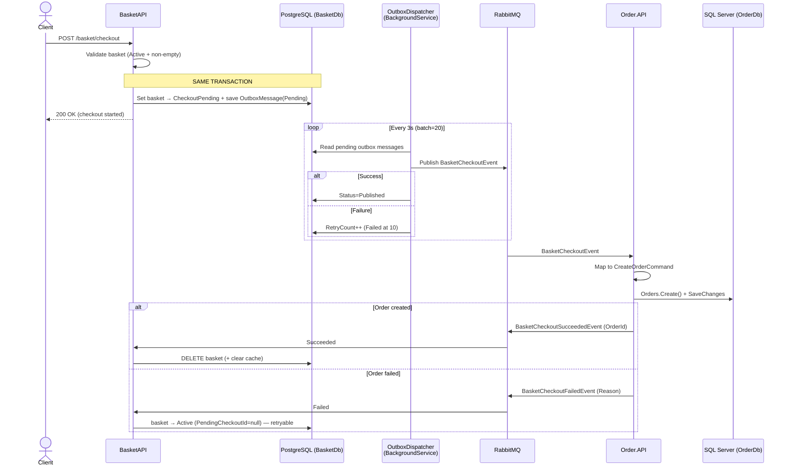

# 07 — Checkout Flow (Outbox + Saga)

Checkout is **intentionally asynchronous and resilient**. It guarantees that a checkout request
is never lost, even against broker/network failures. This is the most critical part of the
system and these guarantees must be preserved when changing it.

## End-to-End Flow

## Step by Step

1. **Client** → `POST /basket/checkout` (BasketAPI).
2. **Basket** validates basket state (`Active`, non-empty; not already `CheckoutPending`).
3. Basket sets the basket to `CheckoutPending` and persists the `BasketCheckoutOutboxMessage` in
   the **same DB transaction** (Outbox pattern). `PendingCheckoutId` is assigned.
4. The **`BasketCheckoutOutboxDispatcher`** background service reads pending rows (every 3s, batch
   of 20) and publishes the `BasketCheckoutEvent` to RabbitMQ.
5. **Order** consumes the event → maps to `CreateOrderCommand` → creates the order.
6. On success Order publishes `BasketCheckoutSucceededEvent`, on failure `BasketCheckoutFailedEvent`.
7. **Basket** consumes the result → success **deletes** the basket, failure resets it to `Active`.

## Why Outbox?

If RabbitMQ publishing failed right after the API call, a classic "publish-on-write" approach
would lose the checkout request. The Outbox prevents this loss by writing the **state change
(basket) and the event to be published in a single atomic transaction**. The event is then
published, with retries, by a separate background process.

| Guarantee | Mechanism |
|---|---|
| Losslessness | Basket + outbox message in the same Marten transaction |
| At-least-once delivery | Dispatcher retries pending until published (max 10) |
| Idempotency | Consumers check `PendingCheckoutId == CheckoutId` |
| Compensation | The failure event resets the basket to `Active` → retryable |

## Related Contracts (BuildingBlockMessaging)

- `BasketCheckoutEvent` — Basket → Order (CheckoutId, UserName, CustomerId, TotalPrice, Items[], address, tokenized payment).
- `BasketCheckoutSucceededEvent` — Order → Basket (CheckoutId, UserName, OrderId).
- `BasketCheckoutFailedEvent` — Order → Basket (CheckoutId, UserName, Reason).

## Related Components

| Component | Location |
|---|---|
| Checkout endpoint + handler | BasketAPI `Basket/CheckoutBasket/` |
| Outbox message / status | BasketAPI `Models/BasketCheckoutOutboxMessage.cs`, `CheckoutOutboxStatus.cs` |
| Dispatcher | BasketAPI `CheckoutSaga/BasketCheckoutOutboxDispatcher.cs` |
| Result consumers | BasketAPI `CheckoutSaga/BasketCheckoutResultConsumers.cs` |
| Order consumer | Order.Application `OrdersCQRS/EventHandlers/Integration/BasketCheckoutEventHandler.cs` |
| Event contracts | `BuildingBlockMessaging/Events/` |

## Cautions When Changing

- Do not "simplify" checkout into a synchronous HTTP call — eventual consistency is the design intent.
- Do not publish the event directly from the API; **always go through the Outbox**.
- If you add a new consumer, make sure it is registered with MassTransit, otherwise events are silently dropped.
- Changing a shared event contract affects all producers/consumers — update them all.

Related: [04 — Basket](04-basket-service.md) · [06 — Order](06-order-service.md) · [02 — Building Blocks](02-building-blocks.md)
