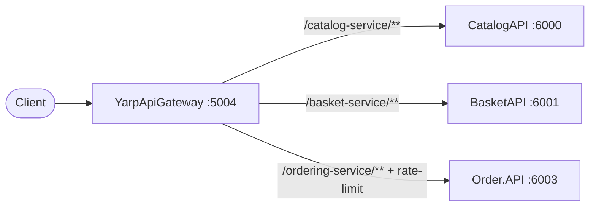

# 08 — Gateway & Deployment

## YarpApiGateway

Reverse proxy + rate limiting. Routes to services using the YARP route/cluster configuration in
`appsettings.json`. It is **not part of docker-compose**; it is run separately when needed.
Local port: `5004`.

### Program.cs

```csharp
builder.Services.AddReverseProxy()
    .LoadFromConfig(builder.Configuration.GetSection("ReverseProxy"));

builder.Services.AddRateLimiter(rateLimiterOptions =>
{
    rateLimiterOptions.AddFixedWindowLimiter("fixed", options =>
    {
        options.Window = TimeSpan.FromSeconds(10);
        options.PermitLimit = 5;          // 5 requests per 10 seconds
    });
});

var app = builder.Build();
app.UseRateLimiter();
app.MapReverseProxy();
app.Run();
```

### Route → Cluster Mapping (appsettings.json)

| Route | Incoming path | Target (cluster) | Rate limit |
|---|---|---|---|
| `catalog-route` | `/catalog-service/{**catch-all}` | `http://localhost:6000/` | — |
| `basket-route` | `/basket-service/{**catch-all}` | `http://localhost:6001/` | — |
| `ordering-route` | `/ordering-service/{**catch-all}` | `http://localhost:6003/` | **fixed** (5 req / 10s) |
| `route1` (catch-all) | `{**catch-all}` | `http://localhost:6000/products` | — |

Each route strips the prefix with a `PathPattern: {**catch-all}` transform (e.g.
`/catalog-service/products` → reaches the service as `/products`).



> **Common mistake:** When adding a new endpoint behind the gateway, if no YARP route is added,
> the endpoint works directly on the service but returns 404 through the gateway.

> **Note:** Discount (gRPC) is not exposed through the gateway; it is only called by Basket via
> in-cluster gRPC.

---

## docker-compose

`docker-compose.yml` (service/image definitions) + `docker-compose.override.yml` (env, ports, volumes).
The gateway is not included.

### Containers

| Container | Image | Published ports | Description |
|---|---|---|---|
| `catalogdb` | `postgres:17-alpine` | `5432:5432` | CatalogDb (volume: postgres_catalog) |
| `basketdb` | `postgres:17-alpine` | `5433:5432` | BasketDb (volume: postgres_basket) |
| `orderdb` | `mcr.microsoft.com/mssql/server` | `1433:1433` | OrderDb (SA_PASSWORD=MyDb1234!) |
| `distributedcache` | `redis` | `6379:6379` | Basket cache |
| `messagebroker` | `rabbitmq:management` | `5672:5672`, `15672:15672` | hostname `ecommerce-mq` |
| `catalogapi` | build: CatalogAPI/Dockerfile | `6000:8080`, `6060:8081` | |
| `basketapi` | build: BasketAPI/Dockerfile | `6001:8080`, `6061:8081` | |
| `discountgrpc` | build: DiscountGrpc/Dockerfile | `6002:8080`, `6062:8081` | |
| `order.api` | build: Order.API/Dockerfile | `6003:8080`, `6063:8081` | |

### In-Container Connectivity (override env)

- **basketapi:** `PostgreDataBase=Server=basketdb;...`, `Redis=distributedcache:6379`,
  `GrpcSettings__DiscountUrl=https://discountgrpc:8081`, `MessageBroker__Host=amqp://ecommerce-mq:5672`.
- **order.api:** `Database=Server=orderdb;...`, `MessageBroker__Host=amqp://ecommerce-mq:5672`,
  `FeatureManagement__OrderFullfilment=false`.
- **catalogapi:** `PostgreDataBase=Server=catalogdb;...`.

Ordering via `depends_on`: basketapi → (basketdb, distributedcache, discountgrpc, messagebroker);
order.api → (orderdb, messagebroker); catalogapi → catalogdb.

### Port Map Summary

| Service | Docker (HTTP/HTTPS) | Local launch profile |
|---|---|---|
| CatalogAPI | 6000 / 6060 | 5000 |
| BasketAPI | 6001 / 6061 | 5001 |
| DiscountGrpc | 6002 / 6062 | 5002 |
| Order.API | 6003 / 6063 | 5003 |
| YarpApiGateway | (not in compose) | 5004 |

---

## Build & Run

```bash
docker compose up -d --build      # all infra + services (excluding gateway)
dotnet build                      # build the solution
dotnet test                       # run the test project
dotnet run --project Src/...      # run a single service from CLI
```

- RabbitMQ management UI: `http://localhost:15672` (guest/guest).
- Run the gateway separately: `dotnet run --project Src/ApiGateways/YarpApiGateway`.

## Health Checks

`GET /health` — Catalog (PostgreSQL), Basket (PostgreSQL + Redis), Order (SQL Server).
Returns JSON in HealthChecks UI format.

Next: [09 — Testing Strategy](09-testing.md)
