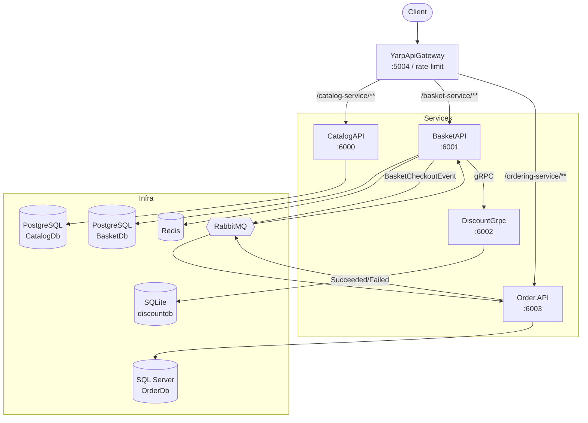

# E-Commerce Microservices — Architecture Documentation

This directory documents the architecture of the `ECommerce_Microservices` solution in detail.
Built on **.NET 9**, it is a modular e-commerce backend demonstrating service-level data
ownership, synchronous (HTTP/gRPC) and asynchronous (RabbitMQ / MassTransit) communication,
resilient checkout orchestration (Outbox + Saga), and CQRS patterns with MediatR.

## Table of Contents

| # | Document | Topic |
|---|---|---|
| 01 | [System Overview](01-system-overview.md) | Services, boundaries, communication models, tech stack |
| 02 | [Building Blocks (Shared Layer)](02-building-blocks.md) | CQRS abstractions, pipeline behaviors, exception handling, messaging infrastructure |
| 03 | [Catalog Service](03-catalog-service.md) | Product CRUD, Marten/PostgreSQL, vertical slice |
| 04 | [Basket Service](04-basket-service.md) | Basket, Redis cache, gRPC client, Outbox |
| 05 | [Discount Service (gRPC)](05-discount-service.md) | Coupon management, gRPC, EF Core/SQLite |
| 06 | [Order Service](06-order-service.md) | Clean Architecture, DDD, EF Core/SQL Server |
| 07 | [Checkout Flow (Outbox + Saga)](07-checkout-flow.md) | End-to-end eventually-consistent checkout |
| 08 | [Gateway & Deployment](08-gateway-and-deployment.md) | YARP gateway, rate limiting, docker-compose, ports |
| 09 | [Testing Strategy](09-testing.md) | xUnit, Moq, layer-based testing approach |

## High-Level Architecture Diagram

## Core Architectural Principles

- **Service data ownership:** Each service owns its own database; it never reads another service's DB directly.
- **Two structural styles coexist:** Catalog/Basket/Discount → vertical slice; Order → layered Clean Architecture.
- **Synchronous + Asynchronous communication:** HTTP & gRPC (synchronous), RabbitMQ/MassTransit (asynchronous).
- **Resilient checkout:** Lossless checkout against broker/network failures via Outbox + Saga.
- **CQRS + MediatR:** Every write goes through a Command, every read through a Query; pipeline behaviors handle validation and logging.

> This documentation is generated from the source code. If it conflicts with the code, the code is authoritative.
