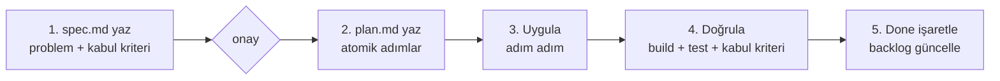

# Fixes — Spec-Driven Çalışma Alanı

Bu dizin, [../improvement-plan.md](../improvement-plan.md) içindeki bulguları **spec-driven**
(önce şartname, sonra plan, sonra uygulama) bir yöntemle, sırayla ve güvenli adımlarla
uygulamak için kullanılır.

## Spec-Driven Akış

Her düzeltme (FIX) kendi klasöründe yaşar ve iki belge içerir:

```
docs/fixes/
  _TEMPLATE/
    spec.md     # NE & NEDEN: problem, kapsam, kabul kriterleri (uygulamadan ÖNCE onaylanır)
    plan.md     # NASIL: sıralı, atomik adımlar + doğrulama + rollback
  FIX-00X-konu/
    spec.md
    plan.md
```

**Yaşam döngüsü (her FIX için):**



**Kurallar:**
- Aynı anda **tek bir FIX** üzerinde çalışılır; bağımlılık sırasına uyulur.
- Her FIX küçük ve tek sorumlu olmalı; büyükse alt-scope'lara bölünür (`FIX-013.1`, `FIX-013.2` …).
- Her FIX sonunda `dotnet build` + `dotnet test` **yeşil** olmalı.
- Kapsam dışına çıkılmaz; yeni bulgu çıkarsa yeni bir FIX açılır.
- Bir FIX'in `spec.md`'si onaylanmadan `plan.md` uygulanmaz.

## Durum Lejantı

| Simge | Anlam |
|---|---|
| ⬜ | Açık (spec hazır değil veya bekliyor) |
| 📝 | Spec yazıldı, onay/uygulama bekliyor |
| 🔄 | Uygulanıyor |
| ✅ | Tamamlandı (build+test+kabul kriteri geçti) |

---

## Backlog (uygulama sırası)

> Sıra; öncelik (P0→P5) ve bağımlılıklara göredir. Spec dosyaları **just-in-time** üretilir:
> P0 batch'i hazırdır; sonraki batch'lerin spec/plan'ı sıra gelince yazılır.

### Sprint 1 — P0 / Hatalar (hazır)

| ID | Başlık | Boyut | Durum | Branch / PR | Spec |
|---|---|---|---|---|---|
| FIX-001 | Feature flag adı uyuşmazlığı (`OrderFullfilment` ↔ `OrderFullfillment`) | XS | ✅ | merged `#34` | [spec](FIX-001-feature-flag-mismatch/spec.md) · [plan](FIX-001-feature-flag-mismatch/plan.md) |
| FIX-002 | `IntegrationEvent` kimlik kararlılığı (id/OccuredOn) | S | 🔄 | `fix/messaging-event-identity` (PR bekliyor) | [spec](FIX-002-integration-event-identity/spec.md) · [plan](FIX-002-integration-event-identity/plan.md) |
| FIX-003 | GetBasket endpoint OpenAPI metadata düzeltmesi | XS | 🔄 | `fix/basket-getbasket-metadata` (PR bekliyor) | [spec](FIX-003-getbasket-endpoint-metadata/spec.md) · [plan](FIX-003-getbasket-endpoint-metadata/plan.md) |
| FIX-004 | `CachedBasketRepository` null güvenliği | S | 🔄 | `fix/basket-cache-null-safety` (PR bekliyor) | [spec](FIX-004-cached-basket-null-safety/spec.md) · [plan](FIX-004-cached-basket-null-safety/plan.md) |
| FIX-005 | CancellationToken yayılımı (repository SaveChanges) | XS | 🔄 | `fix/basket-cancellation-token` (PR bekliyor) | [spec](FIX-005-cancellation-token-propagation/spec.md) · [plan](FIX-005-cancellation-token-propagation/plan.md) |

> **FIX-002–005 ilerleme:** Her biri ayrı branch'e uygulanıp push edildi. Build ✅ · Test: her birinde
> 28 geçti / 4 **önceden var olan** (bu fix'lerle ilgisiz, master'da da kırık) hata. PR'lar UI'da açılmayı bekliyor.
> Tarama notu (FIX-005): DiscountService ve Order seeding'de de parametresiz `SaveChangesAsync()` var —
> ayrı bir takip FIX'i olarak ele alınmalı (kapsam şişirmemek için bu FIX'e dahil edilmedi).

### Sprint 2 — P1 / Dayanıklılık

| ID | Başlık | Boyut | Durum | Not |
|---|---|---|---|---|
| FIX-006 | Outbox retention / temizleme | S | 🔄 | Yayınlanan outbox satırları 1s sonra silinir |
| FIX-007 | MassTransit retry | M | 🔄 | In-memory retry eklendi; delayed redelivery RabbitMQ plugin gerektirdiği için **ertelendi** |
| FIX-008 | Order tarafı idempotency / inbox | M | ✅ | **Doğrulandı:** `CreateOrderHandler` zaten idempotent (OrderId=CheckoutId) + Basket `PendingCheckoutId` koruması. Tam inbox = over-engineering/migration riski → eklenmedi |
| FIX-009 | gRPC resilience | M | 🔄 | gRPC çağrısına 5s deadline; tam retry/circuit-breaker + batch **ertelendi** (yeni paket/proto gerekir) |
| FIX-010 | `DispatchDomainEventsInterceptor` async-only | S | 🔄 | Sync (sync-over-async) override kaldırıldı |
| FIX-011 | Health check'ler | M | 🔄 | Discount + Gateway `/health` eklendi; docker-compose healthcheck/depends_on **ertelendi** (compose doğrulanamıyor) |

> **Sprint 2 ilerleme:** FIX-006, 007, 009, 010, 011 + FIX-024 **tek branch'te** toplandı:
> `fix/p1-reliability` (PR bekliyor). Build ✅ · **Test: 32/32 geçiyor** (önceki 4 kırık test onarıldı).
>
> **Onarılan 4 test + 1 üretim kontrat hatası:**
> - `CheckoutBasket` endpoint'i `Results.Ok` (200) dönerken `Produces(201)` ilan ediyordu → **üretim fix'i** (200'e hizalandı).
> - `CreateOrderHandlerTests`: EF **InMemory** `ComplexProperty`'yi (Address) sorgulayamıyor → testler **SQLite in-memory** (ilişkisel) sağlayıcıya taşındı.
> - `BasketCheckoutEventHandlerTests`: Moq callback imzası `IRequest<CreateOrderResult>` olmalıydı.
> - `CheckoutBasketEndpointContractTests`: endpoint'ler `IEndpointRouteBuilder.DataSources`'tan okunmalı (DI `EndpointDataSource` pipeline kurulmadan dolmuyor).

### Sprint 3 — P2 / Güvenlik

| ID | Başlık | Boyut | Durum | Bağımlılık |
|---|---|---|---|---|
| FIX-012 | Sırların dışarı alınması (secrets) | S | ⬜ | — |
| FIX-013 | Authentication & Authorization (EPIC — bölünür) | XL | ⬜ | FIX-012 |
| └ FIX-013.1 | Paylaşılan JWT doğrulama altyapısı | M | ⬜ | FIX-012 |
| └ FIX-013.2 | Gateway'de merkezi kimlik doğrulama | M | ⬜ | FIX-013.1 |
| └ FIX-013.3 | Basket/Order endpoint'lerini koruma | M | ⬜ | FIX-013.2 |
| FIX-014 | HTTPS redirection/HSTS + rate limit genişletme | S | ⬜ | FIX-011 |

### Sprint 4 — P3 / Gözlemlenebilirlik

| ID | Başlık | Boyut | Durum | Bağımlılık |
|---|---|---|---|---|
| FIX-015 | Serilog standardizasyonu (paylaşılan) | M | ⬜ | — |
| FIX-016 | OpenTelemetry tracing + CorrelationId | L | ⬜ | FIX-015, FIX-002 |

### Sprint 5 — P4 / Test

| ID | Başlık | Boyut | Durum | Bağımlılık |
|---|---|---|---|---|
| FIX-017 | Checkout saga birim testleri | M | ⬜ | FIX-006..008 |
| FIX-018 | Order/Discount handler + consumer testleri | M | ⬜ | — |
| FIX-019 | Integration testleri (WebApplicationFactory + Testcontainers) | L | ⬜ | — |

### Sürekli — P5 / Tutarlılık & Bakım

| ID | Başlık | Boyut | Durum | Bağımlılık |
|---|---|---|---|---|
| FIX-020 | İsimlendirme / yazım hatası temizliği | S | ⬜ | — |
| FIX-021 | Central Package Management + sürüm hizalama | S | ⬜ | — |
| FIX-022 | Gateway'i docker-compose'a ekleme | S | ⬜ | FIX-011 |
| FIX-023 | Swagger/OpenAPI UI + API versiyonlama | M | ⬜ | — |
| FIX-024 | CancellationToken yayılımı — DiscountService (gRPC) | XS | ✅ | FIX-005 takibi; `fix/p1-reliability` ile merge edildi |
| FIX-025 | Gateway'i docker-compose'a entegre et + startup ordering | M | 🔄 | `fix/gateway-docker-integration`; gateway container'da, hedefler servis-DNS, healthcheck+`service_healthy`, catch-all kaldırıldı |

**Boyut:** XS (<1s), S (~yarım gün), M (~1 gün), L (birkaç gün), XL (epic, bölünmeli).

---

## Sonraki adım

P0 batch'i (FIX-001..005) uygulamaya hazır. Sıradaki batch'in (P1) spec/plan dosyaları, o sıraya
gelindiğinde — spec-driven prensibine uygun şekilde — yazılacaktır.
