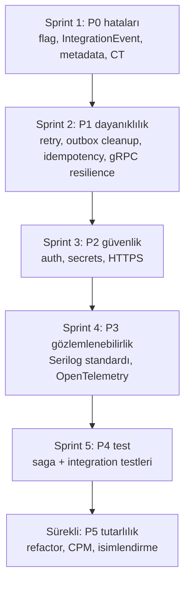

# E-Commerce Microservices — Fix & Geliştirme Planı

Bu belge, kaynak kod incelemesine dayanarak hazırlanmış önceliklendirilmiş bir iyileştirme
planıdır. Her madde **kanıt (dosya/satır)**, **etki** ve **önerilen düzeltme** içerir.
Öncelikler: **P0 (hata/doğruluk)** → **P1 (dayanıklılık)** → **P2 (güvenlik)** →
**P3 (gözlemlenebilirlik)** → **P4 (test)** → **P5 (tutarlılık/bakım)**.

> İnceleme tarihi: 2026-06-15. Referanslar `ECommerce_Microservices/Src` köküne görelidir.

---

## P0 — Hatalar / Doğruluk (önce bunlar)

### P0.1 — `OrderFullfilment` feature flag adı koddaki adla uyuşmuyor 🔴
- **Kanıt:**
  - Config: `Order.API/appsettings.json:11` → `"OrderFullfilment": false`
  - Docker: `docker-compose.override.yml` → `FeatureManagement__OrderFullfilment=false`
  - Kod: `OrderCreateEventHandler.cs:20` → `featureManager.IsEnabledAsync("OrderFullfillment")`
- **Sorun:** Config anahtarı `OrderFullfilment` (tek `l`), kod `OrderFullfillment` (çift `l`).
  İki ad uyuşmadığı için flag **config'ten asla açılamaz** — sipariş oluşturulduğunda
  `OrderDto` entegrasyon event'i hiç yayınlanmaz.
- **Düzeltme:** Tek bir doğru ada (`OrderFulfillment` — doğru İngilizce yazım) karar verip
  hem config hem kod hem docker-compose'da aynı anahtarı kullan. Sabit string yerine bir
  `const` veya `FeatureFlags` sınıfı tanımla.

### P0.2 — `IntegrationEvent.id` ve `OccuredOn` her erişimde yeniden hesaplanıyor 🔴
- **Kanıt:** `BuildingBlockMessaging/Events/IntegrationEvent.cs`
  ```csharp
  public Guid id => Guid.NewGuid();          // her okumada YENİ guid
  public DateTime OccuredOn => DateTime.UtcNow;  // her okumada farklı zaman
  ```
- **Sorun:** Bunlar expression-bodied property; her erişimde yeni değer üretir. Aynı event'in
  `id`'si iki kez okunduğunda farklı çıkar — korelasyon, idempotency, loglama ve olası
  deduplication tamamen bozulur.
- **Düzeltme:** `init`-only set'li sabit değerlere çevir:
  ```csharp
  public Guid Id { get; init; } = Guid.NewGuid();
  public DateTime OccuredOn { get; init; } = DateTime.UtcNow;
  ```
  Ayrıca `id` → `Id` (PascalCase) ve serileştirme uyumluluğunu kontrol et.

### P0.3 — GetBasket endpoint'i yanlış OpenAPI metadata'sına sahip 🟠
- **Kanıt:** `Basket/GetBasket/GetBasketEndpoints.cs:19-23`
  ```csharp
  .WithName("GetProductById")
  .WithSummary("Get Product By Id")
  .WithDescription("Get Product By Id");
  ```
- **Sorun:** Catalog'dan kopyala-yapıştır kalıntısı; route adı ve dokümantasyon yanlış.
  `WithName` çakışması route adıyla link üretiminde sorun çıkarabilir.
- **Düzeltme:** `GetBasket` / "Get Basket" olarak düzelt. Tüm endpoint'lerin
  `WithName`/summary değerlerini gözden geçir.

### P0.4 — `CachedBasketRepository.GetBasket` null dönebilir 🟠
- **Kanıt:** `Data/CachedBasketRepository.cs:16`
  ```csharp
  return JsonSerializer.Deserialize<ShoppingCard>(cachedBasket);  // null olabilir
  ```
- **Sorun:** Metod imzası non-null `ShoppingCard` döndürmeyi vaat ediyor ama deserialize
  `null` dönebilir; bozuk cache verisinde NRE riski.
- **Düzeltme:** `?? throw` veya null kontrolü ekle; deserialize hatasında cache'i atlayıp
  repository'ye düş (graceful fallback).

### P0.5 — Repository `SaveChangesAsync` CancellationToken'ı yok sayıyor 🟡
- **Kanıt:** `Data/BasketRepository.cs:23,29` → `await session.SaveChangesAsync();`
  (parametredeki `cancellationToken` geçilmiyor).
- **Düzeltme:** `await session.SaveChangesAsync(cancellationToken);`. Tüm projede CT
  geçirme tutarlılığını denetle.

---

## P1 — Dayanıklılık & Mesajlaşma

### P1.1 — Outbox tablosu hiç temizlenmiyor (sonsuz büyüme) 🟠
- **Kanıt:** `CheckoutSaga/BasketCheckoutOutboxDispatcher.cs` yalnızca `Published`/`Failed`
  durumuna geçiriyor; `Published` satırları silen bir mekanizma yok.
- **Sorun:** `BasketCheckoutOutboxMessage` tablosu zamanla sınırsız büyür; sorgular yavaşlar.
- **Düzeltme:** Belirli yaştan eski `Published` mesajları silen periyodik bir temizleme
  (retention) ekle; `Status` + `CreatedAt` üzerine Marten index tanımla.

### P1.2 — MassTransit retry / redelivery / error kuyruğu yapılandırılmamış 🟠
- **Kanıt:** `BuildingBlockMessaging/MassTransit/Extentions.cs` yalnızca
  `ConfigureEndpoints(context)` çağırıyor; `UseMessageRetry`, `UseDelayedRedelivery` yok.
- **Sorun:** Consumer'da geçici bir hata olduğunda mesaj doğrudan `_error` kuyruğuna düşer
  (immediate fault). Geçici DB/ağ hatalarına karşı dayanıklılık zayıf.
- **Düzeltme:**
  ```csharp
  configurator.UseMessageRetry(r => r.Interval(3, TimeSpan.FromSeconds(5)));
  configurator.UseDelayedRedelivery(r => r.Intervals(TimeSpan.FromMinutes(1), TimeSpan.FromMinutes(5)));
  ```

### P1.3 — Order tarafında idempotency / inbox yok 🟠
- **Kanıt:** `BasketCheckoutEventHandler` (Order) `CreateOrderCommand`'e map'liyor; handler
  "var olan sipariş kontrolü" yapıyor ama event yeniden teslim edilirse (at-least-once)
  consumer düzeyinde idempotency garantisi yok.
- **Sorun:** Aynı `BasketCheckoutEvent` iki kez işlenirse çift iş riski (CreateOrder
  idempotent ama Succeeded/Failed event'leri tekrar yayınlanabilir).
- **Düzeltme:** MassTransit'in EF Core/Marten **Inbox** desenini veya `CheckoutId` bazlı
  işlenmiş-event tablosunu kullan. Basket consumer'ları zaten `PendingCheckoutId` eşleşmesiyle
  korunuyor — Order tarafı da benzer şekilde sağlamlaştırılmalı.

### P1.4 — Basket → Discount gRPC çağrısında resilience yok 🟠
- **Kanıt:** `StoreBasketCommandHandler.DeductDiscount` her item için Discount'a gRPC çağrısı
  yapıyor; retry/timeout/circuit-breaker yok.
- **Sorun:** Discount yavaş/erişilemezse StoreBasket tamamen başarısız olur; ayrıca her item
  için ayrı çağrı (N+1) — toplu (batch) `GetAllDiscounts` daha verimli olabilir.
- **Düzeltme:** gRPC client'a `AddStandardResilienceHandler()` (Microsoft.Extensions.Http.Resilience)
  veya Polly ekle; deadline/timeout tanımla; mümkünse tek seferde toplu kupon çek.

### P1.5 — `DispatchDomainEventsInterceptor` senkron yolda `GetAwaiter().GetResult()` 🟡
- **Kanıt:** `Order.Infrastructure/Data/Interceptors/DispatchDomainEventsInterceptor.cs`
  → `SavingChanges` (sync) içinde `DispatchDomainEvents(...).GetAwaiter().GetResult()`.
- **Sorun:** Sync-over-async; belirli senkronizasyon bağlamlarında deadlock/thread-starvation
  riski. Pratikte `SaveChangesAsync` kullanılıyorsa tetiklenmez ama tehlike kapıda.
- **Düzeltme:** Mümkünse yalnızca async `SavingChangesAsync`'i destekle; sync yolu
  desteklenmeyecekse net biçimde devre dışı bırak.

### P1.6 — Eksik health check'ler ve docker healthcheck/koşullu depends_on 🟡
- **Kanıt:** Health check yalnızca Catalog/Basket/Order'da; **Discount ve Gateway'de yok**.
  `docker-compose` `depends_on` koşulsuz (sadece başlatma sırası, hazır-olma değil);
  konteynerlerde `healthcheck` tanımı yok.
- **Düzeltme:** Discount'a gRPC health check (`Grpc.HealthCheck`), Gateway'e basit health
  ekle. docker-compose'da DB/broker için `healthcheck` + `depends_on: condition: service_healthy`.

---

## P2 — Güvenlik

### P2.1 — Kimlik doğrulama / yetkilendirme hiç yok 🔴
- **Kanıt:** Tüm `Src` içinde `AddAuthentication`/`AddAuthorization`/`UseAuthentication`
  bulunmuyor. Tüm endpoint'ler anonim; checkout/ödeme dahil.
- **Düzeltme:** JWT bearer (örn. Keycloak/IdentityServer/Entra) ekle; gateway'de merkezi
  doğrulama, servislerde `[Authorize]`/`RequireAuthorization()`. En azından checkout ve
  Order endpoint'leri korunmalı.

### P2.2 — Sırlar appsettings/compose içinde düz metin 🟠
- **Kanıt:** `appsettings.json` ve `docker-compose.override.yml`'de DB şifreleri, RabbitMQ
  guest/guest, `SA_PASSWORD=MyDb1234!` açık.
- **Düzeltme:** User Secrets (dev) + ortam değişkenleri/secret store (prod). Repo'ya gerçek
  sır koyma; örnek değerleri `appsettings.Example.json`'a taşı.

### P2.3 — HTTPS redirection ve güvenlik başlıkları yok 🟡
- **Kanıt:** `UseHttpsRedirection`/HSTS hiçbir serviste yok.
- **Düzeltme:** Gateway seviyesinde TLS sonlandırma + HSTS; servisler arası mTLS
  değerlendir. Dev'de gRPC için self-signed sertifika kabulü zaten var, prod için sertifika
  yönetimi planla.

### P2.4 — Rate limit yalnızca ordering route'ta 🟡
- **Kanıt:** `YarpApiGateway/appsettings.json` → sadece `ordering-route` `fixed` politikasında.
- **Düzeltme:** Catalog/Basket route'larına da uygun limitler; ayrıca catch-all `route1`'in
  gerekli olup olmadığını gözden geçir (güvenlik yüzeyini daraltır).

---

## P3 — Gözlemlenebilirlik

### P3.1 — Serilog yalnızca Catalog'da; loglama tutarsız 🟠
- **Kanıt:** `Serilog` referansları yalnızca `CatalogAPI`'de. Basket/Order/Discount/Gateway
  varsayılan logger kullanıyor.
- **Düzeltme:** Serilog'u paylaşılan bir building block üzerinden tüm servislere standartlaştır
  (ServiceName enrichment + compact JSON). Tek tip log formatı log toplamayı kolaylaştırır.

### P3.2 — Dağıtık izleme (tracing) / korelasyon yok 🟠
- **Kanıt:** OpenTelemetry yok; servisler ve event'ler arası korelasyon ID akışı yok.
- **Düzeltme:** OpenTelemetry (ASP.NET Core + HttpClient + gRPC + MassTransit +
  EF Core/Npgsql instrumentation) ekle; OTLP ile Jaeger/Tempo'ya gönder. Event'lere
  `CorrelationId` taşı (checkout uçtan uca izlenebilsin).

### P3.3 — Merkezi metrik/sağlık panosu yok 🟡
- **Düzeltme:** Health check UI veya `/metrics` (Prometheus) ekle; checkout outbox kuyruk
  derinliği, retry sayıları gibi iş metriklerini ölç.

---

## P4 — Test

### P4.1 — Test kapsamı çok dar 🟠
- **Kanıt:** `Tests/ECommerce_Tests` yalnızca `Basket/GetBasketEndpointTests.cs` içeriyor
  (3 test: get, delete, validator). Order/Catalog/Discount handler'ları, consumer'lar,
  outbox dispatcher, saga telafisi test edilmiyor.
- **Düzeltme (öncelik sırasıyla):**
  1. **Checkout saga** birim testleri: outbox yazımı atomik mi, dispatcher retry/Failed
     geçişleri, Succeeded → sepet sil, Failed → Active'e dön (PendingCheckoutId eşleşmesi).
  2. **Order** handler ve `BasketCheckoutEventHandler` testleri (in-memory DbContext).
  3. **Discount** gRPC servis testleri (kuponsuz ürün → Amount=0 davranışı).
  4. **Integration testleri**: `WebApplicationFactory` + Testcontainers (Postgres/SQL/Redis/RabbitMQ).

### P4.2 — Test mimarisi gerçek pipeline'ı doğrulamıyor 🟡
- **Kanıt:** Mevcut testler endpoint mantığını elle yazılmış lambda ile taklit ediyor; gerçek
  Carter route + MediatR pipeline + ValidationBehavior zincirini çalıştırmıyor.
- **Düzeltme:** En azından kritik akışlarda `WebApplicationFactory` ile uçtan uca test.

---

## P5 — Tutarlılık & Bakım

| # | Konu | Kanıt | Düzeltme |
|---|---|---|---|
| P5.1 | Klasör adı yazım hatası | `CatalogAPI/Products/UpdateProdcut/` | `UpdateProduct` olarak yeniden adlandır |
| P5.2 | Dosya adı yazım hatası | `BuildingBlock/GloblaUsing.cs`, `Order.Domain/GloblaUsing.cs` | `GlobalUsing.cs` |
| P5.3 | Sınıf adı yazım hatası | `Models/ShoppingCard` (muhtemelen `ShoppingCart` kastedildi) | Domain dili netleştir; tutarlı adlandır |
| P5.4 | Tip adı yazım hataları | `NotFoundExceptions`, `CustomExceptionHandler` içinde `SatatusCode`/`excepotionMessage`, `DependecyInjection(s)` | Yeniden adlandır (küçük ama yaygın) |
| P5.5 | Marten sürüm farkı | Catalog `7.38.1` vs Basket `7.37.1` | Tek sürümde hizala (`Directory.Packages.props` ile merkezi sürüm yönetimi) |
| P5.6 | gRPC paket sürüm farkı | Discount `Grpc.AspNetCore 2.64.0` vs Basket `2.67.0` | Hizala |
| P5.7 | Mapster örtük eşleme | Tüm servisler `.Adapt<T>()` kullanıyor, kayıtlı config yok | Karmaşık eşlemeler için `TypeAdapterConfig` + başlangıçta `Compile()` (performans + derleme-zamanı güven) |
| P5.8 | Merkezi paket yönetimi yok | Her csproj sürümleri ayrı tanımlıyor | `Directory.Packages.props` (Central Package Management) |
| P5.9 | Gateway compose dışında | `docker-compose.yml` | Gateway'i compose'a ekle; tek komutla tüm sistem ayağa kalksın |
| P5.10 | Swagger/OpenAPI UI yok | Yalnızca Catalog'da `Microsoft.AspNetCore.OpenApi` referansı, UI yok | Tüm API'lere Swagger UI; gateway'de birleşik dokümantasyon değerlendir |
| P5.11 | API versiyonlama yok | — | `Asp.Versioning` ile sürümleme (kontrat değişikliklerini yönetmek için) |

---

## Önerilen Uygulama Sırası (yol haritası)



**Hızlı kazanımlar (1 günden az, düşük risk):** P0.1, P0.3, P0.5, P5.1, P5.2.
**Yüksek etki / orta efor:** P0.2, P1.1, P1.2, P2.1, P3.2, P4.1.

---

## Notlar

- Bu plan mevcut mimari konvansiyonları (vertical slice / Clean Architecture, Outbox+Saga,
  CQRS) **bozmadan** iyileştirmeyi hedefler. Checkout akışının asenkron/eventual-consistent
  doğası korunmalıdır (bkz. [architecture/07-checkout-flow.md](architecture/07-checkout-flow.md)).
- Her değişiklikten sonra: `dotnet build` + `dotnet test` yeşil olmalı; yeni her
  contract/route/migration uçtan uca bağlanmalı.
- İstenirse her P0/P1 maddesi için ayrı bir uygulama (implementasyon) PR planı çıkarılabilir.
